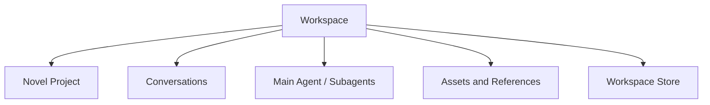
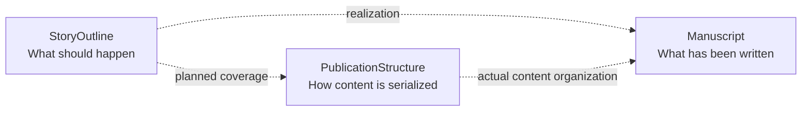
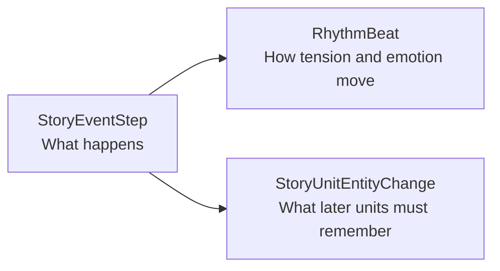
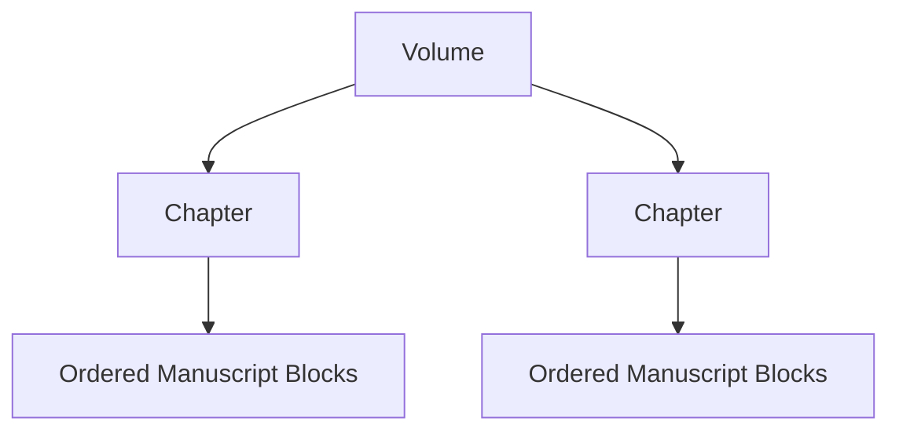
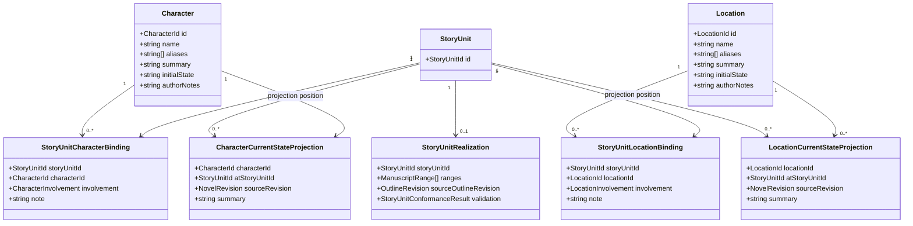

# Novel Domain Working Design

## 1. Document Status

This document records the current Novel-domain design discussion as of August 2, 2026.

- It is a working domain design, not an implementation claim.
- It does not add Novel-domain work to Runtime Task 1 through Task 7.
- Decisions marked **accepted direction** may be used in later Novel-domain planning.
- Decisions marked **current recommendation** still require review before implementation.

## 2. Workspace Boundary

**Accepted direction:** one Workspace corresponds to one Novel project.



- A Workspace owns one Novel project and may contain many Conversations.
- Main agents and subagents operate within the same Workspace access boundary unless explicitly granted read-only external references.
- The canonical Workspace identity remains independent from the physical work directory so an explicit rebind can preserve identity after a project move.
- A future series-level abstraction belongs above Workspace rather than allowing one Workspace to own multiple novels.

## 3. Separate Narrative, Manuscript, and Publication Structures

**Accepted direction:** story decomposition, written content, and publication organization are separate structures.



The Story Outline must not encode `Volume -> Chapter -> Scene` as its required hierarchy. Volume and Chapter are publication concepts, while the Story Outline is a narrative work-breakdown structure similar to a Todo tree.

## 4. Story Outline

### 4.1 Ordered StoryUnit Tree

**Accepted direction:** the outline is an ordered tree of stable `StoryUnit` nodes.

```ts
interface StoryUnit {
  readonly id: StoryUnitId;
  readonly outlineId: StoryOutlineId;
  readonly parentId?: StoryUnitId;
  readonly orderKey: OrderKey;

  readonly title: string;
  readonly intent?: string;
  readonly synopsis?: string;
}
```

- Core does not hard-code first-level, second-level, or third-level nodes.
- A node may be decomposed into smaller ordered child nodes at any time.
- A parent node expresses an aggregate narrative intention and summary rather than a traditional continuous scene.
- A leaf node is the smallest currently planned work unit, but it may later be decomposed without changing its stable identity.
- `StoryUnit` is preferred over calling every level `Scene`; higher-level nodes may represent an arc, sequence, investigation, relationship development, or another aggregate story unit.

An optional semantic scope may help presentation without determining hierarchy:

```ts
type StoryUnitScope =
  | "saga"
  | "arc"
  | "sequence"
  | "scene"
  | "custom";
```

The tree depth and `scope` are independent. User interfaces may show friendly level names without making those names persistence invariants.

### 4.2 Stable Ordering

**Accepted direction:** ordered siblings use stable IDs and opaque fractional ordering keys rather than array indexes or dense integers.

```ts
interface OrderKeyFactory {
  initial(): OrderKey;
  before(next: OrderKey): OrderKey;
  after(previous: OrderKey): OrderKey;
  between(previous: OrderKey, next: OrderKey): OrderKey;
}
```

- Moving a StoryUnit changes only its `parentId` and `orderKey`.
- Inserting a sibling does not renumber all later siblings.
- References always use stable IDs and never use outline paths or array indexes.
- Fractional indexing, LexoRank, or another variable-length lexical rank may implement `OrderKey` behind the stable contract.

### 4.3 Agent-Assisted Rolling Outline

**Accepted direction:** the outline is collaboratively created by the human and Agent rather than manually completed by the human before writing begins.

The human contributes imagination, preferences, constraints, and creative judgment. The Agent may propose StoryUnits, decomposition, LeafStoryUnitPlan details, Character and Location bindings, Events, RhythmBeats, and entity changes. Tools validate identifiers, ordering, revisions, and structural invariants before accepted changes become authoritative outline state.

The entire novel does not need to reach `ready` before manuscript writing starts. Planning advances with a rolling horizon:

```text
Novel direction
    idea or outlined

Current arc
    outlined

Next executable leaf StoryUnits
    ready

Distant future StoryUnits
    idea
```

Only the leaf StoryUnit currently selected for manuscript execution must have an accepted plan that satisfies the configured ready policy.

Agent changes first enter an outline proposal rather than directly replacing accepted StoryUnits:

```ts
type ReviewStatus =
  | "proposed"
  | "accepted"
  | "rejected";

interface OutlineProposal {
  readonly id: OutlineProposalId;
  readonly baseRevision: OutlineRevision;
  readonly operations: readonly OutlineOperation[];
  readonly reviewStatus: ReviewStatus;
}
```

- `baseRevision` prevents an Agent proposal based on stale outline state from overwriting newer decisions.
- `operations` apply one reviewable outline change set atomically after acceptance.
- A rejected proposal leaves accepted outline and manuscript state unchanged.
- Accepted operations advance OutlineRevision and global NovelRevision.
- Proposal origin and actor identity belong in audit metadata or Novel-domain Events rather than changing the semantics of the resulting StoryUnit.
- Once accepted, a StoryUnit has the same authority whether its content originated from the human, Agent, or a joint editing process.
- Conformance validation uses only accepted outline state; proposed changes cannot silently redefine the manuscript specification.

Recommended approval boundary:

- Agents may freely generate proposals, decomposition alternatives, missing-field suggestions, RhythmBeat suggestions, projections, and validation findings.
- Low-risk, repairable projection or indexing work may be auto-accepted by policy.
- Adding or removing required Events, changing entity consequences, moving accepted StoryUnits, modifying ready or realized leaf plans, abandoning StoryUnits, and marking realization complete require review under the configured approval policy.

## 5. StoryUnit Status and Reasons

**Current recommendation:** a Todo-like outline needs status, but planning maturity, manuscript realization, and temporary blocking are separate concerns.

### 5.1 Planning and Realization Status

```ts
type StoryUnitPlanningStatus =
  | "idea"
  | "outlined"
  | "ready";

type StoryUnitRealizationStatus =
  | "pending"
  | "in-progress"
  | "completed"
  | "abandoned";
```

```ts
interface StoryUnit {
  readonly planningStatus: StoryUnitPlanningStatus;
  readonly realizationStatus: StoryUnitRealizationStatus;
  readonly blockState?: StoryUnitBlockState;
  readonly abandonment?: StoryUnitAbandonment;
}
```

Semantics:

- `planningStatus` answers whether the collaboratively produced narrative intention is sufficiently defined and accepted for writing; it does not identify whether the human or Agent authored the content.
- `realizationStatus` answers whether that intention has been accepted as realized in manuscript content.
- `pending` means manuscript realization has not started.
- `in-progress` means some realization exists or active drafting and revision work has started, but the StoryUnit is not accepted as complete.
- `completed` means its narrative intention has been expressed in manuscript content, the realization conforms to the current outline and manuscript revisions, and the result has been accepted by the author or workflow.
- `abandoned` means the author no longer intends to realize this StoryUnit; it remains addressable for history, replacement tracking, and possible restoration.
- Producing text does not automatically mean `completed`, and `completed` does not mean published or permanently immutable.

### 5.2 Blocking Is Independent

`blocked` is a temporary execution condition rather than a manuscript-realization phase. Keeping it outside `realizationStatus` preserves whether the StoryUnit was pending or already in progress when it became blocked.

```ts
type StoryUnitBlockReason =
  | "dependency"
  | "decision-required"
  | "continuity-conflict"
  | "missing-material"
  | "outline-incomplete"
  | "other";

interface StoryUnitBlockState {
  readonly reasonCode?: StoryUnitBlockReason;
  readonly note?: string;
  readonly dependencyIds: readonly StoryUnitId[];
  readonly blockedAt: string;
}
```

- `reasonCode` supports filtering, automation, and Agent routing.
- `note` is an optional human-readable explanation of the current blocking condition.
- `dependencyIds` identifies StoryUnits whose progress or decisions may unblock this unit.
- Clearing the block removes the current `blockState`; the historical transition remains in Novel-domain Events.

### 5.3 Abandonment Information

An abandoned StoryUnit retains a structured reason and may point to the StoryUnit that replaced it.

```ts
type StoryUnitAbandonReason =
  | "story-direction-changed"
  | "replaced"
  | "merged"
  | "duplicate"
  | "scope-reduced"
  | "other";

interface StoryUnitAbandonment {
  readonly reasonCode?: StoryUnitAbandonReason;
  readonly note?: string;
  readonly replacementStoryUnitId?: StoryUnitId;
  readonly abandonedAt: string;
}
```

- `note` explains why the author abandoned the unit without overloading a generic status note.
- `replacementStoryUnitId` prevents replacement from being interpreted as simple deletion and helps Agents avoid proposing an obsolete direction again.
- `abandonment` is required while `realizationStatus` is `abandoned` and is cleared from current state if the unit is restored.

Recommended current-state invariants:

```text
realizationStatus = pending | in-progress
    blockState may be present

realizationStatus = completed
    blockState and abandonment are absent

realizationStatus = abandoned
    abandonment is present
    blockState is absent
```

### 5.4 Composite Progress

Leaf realization status may be stored directly. Composite progress should normally be exposed as a derived roll-up rather than maintained as a conflicting second source of truth.

```ts
interface StoryUnitProgressProjection {
  readonly storyUnitId: StoryUnitId;
  readonly effectiveStatus: StoryUnitRealizationStatus;
  readonly isBlocked: boolean;
  readonly completedLeafCount: number;
  readonly totalLeafCount: number;
}
```

Whether a composite StoryUnit may own an explicit block override, rather than only deriving blocked state from descendants, remains a command-model decision.

### 5.5 Status History

Current StoryUnit fields expose current state; Novel-domain Events preserve transition history:

```text
StoryUnitBlocked
StoryUnitUnblocked
StoryUnitAbandoned
StoryUnitRestored
```

Domain persistence may retain reason notes in these Events. Structured Runtime logs must only record safe identifiers and lifecycle metadata and must not emit the natural-language note content.

## 6. Leaf StoryUnit Plan

**Current recommendation:** a leaf StoryUnit is the smallest currently executable writing specification. It describes time, participating Characters and Locations, objective Events, intended emotional rhythm, and the persistent entity changes that the manuscript must realize.

```ts
interface LeafStoryUnitPlan {
  readonly storyUnitId: StoryUnitId;
  readonly time?: StoryTimeDescription;
  readonly characters: readonly StoryUnitCharacterBinding[];
  readonly locations: readonly StoryUnitLocationBinding[];
  readonly events: readonly StoryEventStep[];
  readonly rhythmBeats: readonly RhythmBeat[];
  readonly entityChanges: readonly StoryUnitEntityChange[];
}
```

A leaf plan answers five questions:

1. When does this unit happen?
2. Where does it happen?
3. Which Characters participate or are affected?
4. What objectively happens, and how should emotional tension rise or fall?
5. What persistent Character or Location changes must later StoryUnits remember?

The plan is progressively populated by human and Agent collaboration:

- `idea` may contain only title and intent.
- `outlined` may contain partial time, bindings, Events, rhythm, and entity changes.
- `ready` means the accepted leaf plan satisfies a Tool-enforced readiness policy and may be used as the manuscript specification.

RhythmBeats remain optional. Character or Location bindings and entity changes may be empty when the StoryUnit semantics do not require them. The initial ready policy should require at least a usable time description, a coherent primary setting when applicable, and one objective Event, while allowing future policy configuration.

If a leaf StoryUnit is decomposed into children, its detailed plan must be migrated, summarized, or archived through an accepted proposal rather than silently duplicated across parent and child nodes.

### 6.1 Story Time

```ts
interface StoryTimeDescription {
  readonly description: string;
  readonly timelineOrderKey?: OrderKey;
}
```

- `description` permits natural-language time such as `the following morning` or `ten years earlier`.
- `timelineOrderKey` is optional initial support for story-world chronology that differs from outline or manuscript order.
- The initial model does not require a complete calendar system.

### 6.2 StoryEventStep

`StoryEventStep` describes what objectively happens.

```ts
interface StoryEventStep {
  readonly id: StoryEventStepId;
  readonly storyUnitId: StoryUnitId;
  readonly orderKey: OrderKey;
  readonly description: string;
}
```

Events are ordered implementation requirements for the manuscript. They do not directly describe emotional rhythm and do not need independent Todo lifecycle state.

### 6.3 RhythmBeat

`RhythmBeat` describes intended emotion, tension, turning points, climax, release, and aftermath. It does not describe the objective Event itself.

```ts
type RhythmDirection =
  | "setup"
  | "rise"
  | "hold"
  | "turn"
  | "climax"
  | "fall"
  | "release"
  | "aftermath";

type RhythmIntensity = 1 | 2 | 3 | 4 | 5;

interface RhythmBeat {
  readonly id: RhythmBeatId;
  readonly storyUnitId: StoryUnitId;
  readonly orderKey: OrderKey;
  readonly rhythm: RhythmDirection;
  readonly intensity: RhythmIntensity;
  readonly readerEmotion?: string;
  readonly pointOfViewEmotion?: string;
  readonly description?: string;
  readonly relatedEventIds: readonly StoryEventStepId[];
}
```

- `readerEmotion` expresses the intended reader experience.
- `pointOfViewEmotion` expresses the point-of-view Character's experience; it may intentionally differ from reader emotion.
- `relatedEventIds` identifies which objective Events carry the rhythm point.
- RhythmBeat is optional, carries no Todo status, owns no manuscript content, and cannot be promoted into a child StoryUnit.
- If an Event or leaf StoryUnit becomes too complex, the Event or StoryUnit is decomposed and its RhythmBeats are replanned.

### 6.4 StoryUnitEntityChange

`StoryUnitEntityChange` describes what later StoryUnits must remember after this unit is realized.

```ts
type StoryEntityChangeCategory =
  | "identity"
  | "condition"
  | "location"
  | "relationship"
  | "knowledge"
  | "goal"
  | "ownership"
  | "environment"
  | "custom";

interface StoryUnitEntityChange {
  readonly id: StoryUnitEntityChangeId;
  readonly storyUnitId: StoryUnitId;
  readonly entityType: "character" | "location";
  readonly entityId: StoryEntityId;
  readonly relatedEntityId?: StoryEntityId;
  readonly category: StoryEntityChangeCategory;
  readonly summary: string;
  readonly sourceEventIds: readonly StoryEventStepId[];
}
```

- Character relationships are recorded only as sparse, story-relevant changes with an optional `relatedEntityId`; the initial model does not maintain a complete pairwise relationship graph.
- Location changes use the same mechanism for damage, ownership, access, environmental condition, and other persistent consequences.
- The model maintains one authoritative entity-change specification per StoryUnit. It does not preserve separate long-lived `expectedChanges` and `actualChanges` truth sets.



## 7. Manuscript Organization

**Accepted direction:** written content uses stable content Blocks organized by publication containers.

```ts
interface ParagraphBlock {
  readonly id: ManuscriptBlockId;
  readonly chapterId: ChapterId;
  readonly orderKey: OrderKey;
  readonly text: string;
}
```

- Paragraph is the initial persistent editing unit.
- Sentence is not a persistent domain entity; precise operations use offsets within a Block.
- Chapter is an ordered container of Manuscript Blocks rather than a fragile global array-index range.
- Volume is an ordered container of Chapters.
- StoryUnit does not become owned by Chapter merely because its realization appears in that Chapter.



## 8. Manuscript Anchors, Realization, and Conformance

StoryUnits associate with written content through stable Block anchors:

```ts
interface ManuscriptAnchor {
  readonly blockId: ManuscriptBlockId;
  readonly offset?: number;
  readonly bias: "left" | "right";
}

interface ManuscriptRange {
  readonly start: ManuscriptAnchor;
  readonly end: ManuscriptAnchor;
}

interface StoryUnitRealization {
  readonly storyUnitId: StoryUnitId;
  readonly ranges: readonly ManuscriptRange[];
  readonly sourceOutlineRevision: OutlineRevision;
  readonly validation: StoryUnitConformanceResult;
}
```

- Ranges never use array indexes.
- Blocks inserted between existing anchors are naturally included according to current order.
- Anchor bias determines whether insertion at an exact boundary belongs inside or outside a range.
- One StoryUnit may realize across multiple ranges and Chapters.
- Node movement in the outline does not invalidate manuscript realization because the StoryUnit ID remains stable.

The manuscript is an implementation of the StoryUnit specification rather than an independent source of alternate story facts. A realization records where the StoryUnit is implemented and whether that content conforms to the current outline.

```ts
type StoryUnitConformanceStatus =
  | "pending"
  | "conforming"
  | "non-conforming"
  | "stale";

type StoryUnitConformanceFindingType =
  | "missing-event"
  | "unexpected-event"
  | "character-mismatch"
  | "location-mismatch"
  | "time-mismatch"
  | "missing-entity-change"
  | "contradictory-entity-change"
  | "rhythm-mismatch"
  | "other";

interface StoryUnitConformanceFinding {
  readonly type: StoryUnitConformanceFindingType;
  readonly severity: "warning" | "error";
  readonly note: string;
  readonly manuscriptRanges: readonly ManuscriptRange[];
}

interface StoryUnitConformanceResult {
  readonly status: StoryUnitConformanceStatus;
  readonly checkedOutlineRevision: OutlineRevision;
  readonly checkedManuscriptRevision: ManuscriptRevision;
  readonly findings: readonly StoryUnitConformanceFinding[];
}
```

Conformance semantics:

- `pending` means the current manuscript ranges have not yet been checked.
- `conforming` means the manuscript satisfies the current StoryUnit Events, entity changes, Character and Location bindings, time requirements, and accepted rhythm expectations.
- `non-conforming` means required semantics are missing, contradicted, or changed by the manuscript.
- `stale` means either the relevant outline or manuscript changed after validation.
- Additional prose detail is allowed when it does not create a conflicting persistent story fact.
- A new semantic Event or entity change must either be removed from the manuscript or explicitly added to the outline through an accepted outline mutation before validation can succeed.

A StoryUnit may enter `realizationStatus: completed` only when it has at least one current ManuscriptRange and a `conforming` validation checked against the current OutlineRevision and ManuscriptRevision. Conformance failure keeps the StoryUnit in progress; it does not create an alternate actual-facts table.

If the human changes creative direction, or accepts an Agent proposal that changes it while drafting, the outline is explicitly revised and the manuscript is revalidated. The model treats this as a specification change rather than silent manuscript divergence.

Deletion and structural edits require reference preservation:

- Deleted Blocks first become tombstones rather than disappearing while references still exist.
- Splitting a Block preserves one stable ID and records how anchors transform into the new Block.
- Merging Blocks retains a stable target and records a redirect from removed IDs.
- Moving a Block preserves its ID and changes only its container and ordering key.
- Invalid, inverted, disconnected, or orphaned ranges must be surfaced for repair rather than silently reinterpreted.

## 9. Publication Relationship

Chapter and Volume are publication structures whose actual authority is written content.

- A Chapter owns an ordered collection of Manuscript Blocks.
- A Chapter may also have optional planned StoryUnit coverage before content exists.
- Planned StoryUnit coverage answers what the chapter intends to contain; Manuscript Blocks answer what it actually contains.
- A Volume owns ordered Chapters, and its actual manuscript coverage is derived from them rather than duplicated as another authoritative range.
- A Volume may reference a primary higher-level StoryUnit for narrative intent, but that association is not its content boundary.

## 10. Initial Mutation Strategy

**Accepted direction:** initial Novel mutation uses serialized commands and revision checks rather than making the whole domain a CRDT.

```text
Novel Command Queue
    -> validate base revision
    -> apply one mutation
    -> maintain anchors and references
    -> persist
    -> publish Novel Event
```

- Fractional ordering keys handle frequent sibling and paragraph insertion.
- Stable IDs preserve references across movement.
- Tombstones and redirects preserve references across deletion, splitting, and merging.
- Optimistic revisions detect stale concurrent commands.
- A future collaborative editor may introduce CRDT behavior at the Paragraph text adapter boundary without changing the whole Novel domain contract.

## 11. Minimal Progressive Character and Location Models

**Current recommendation:** Character and Location records begin as minimal stable identities and are progressively enriched by human and Agent collaboration only when upcoming StoryUnits need more information. Leaf StoryUnits remain responsible for participation, Events, rhythm, and changing narrative state. Tools may derive reviewable readiness and current-state projections from those sources.

### 11.1 Minimal Contracts

```ts
interface Character {
  readonly id: CharacterId;
  readonly name: string;
  readonly aliases: readonly string[];
  readonly summary?: string;
  readonly initialState?: string;
  readonly authorNotes?: string;
}

interface Location {
  readonly id: LocationId;
  readonly name: string;
  readonly aliases: readonly string[];
  readonly summary?: string;
  readonly initialState?: string;
  readonly authorNotes?: string;
}

interface StoryUnitCharacterBinding {
  readonly storyUnitId: StoryUnitId;
  readonly characterId: CharacterId;
  readonly involvement?: CharacterInvolvement;
  readonly note?: string;
}

interface StoryUnitLocationBinding {
  readonly storyUnitId: StoryUnitId;
  readonly locationId: LocationId;
  readonly involvement?: LocationInvolvement;
  readonly note?: string;
}

interface CharacterCurrentStateProjection {
  readonly characterId: CharacterId;
  readonly atStoryUnitId: StoryUnitId;
  readonly sourceRevision: NovelRevision;
  readonly summary: string;
}

interface LocationCurrentStateProjection {
  readonly locationId: LocationId;
  readonly atStoryUnitId: StoryUnitId;
  readonly sourceRevision: NovelRevision;
  readonly summary: string;
}
```



The binding and realization do not own one another. Both refer to the same stable StoryUnit for different purposes:

- `StoryUnitCharacterBinding` records planned character participation in the outline.
- `StoryUnitLocationBinding` records planned primary, secondary, or mentioned Locations in the outline.
- `StoryUnitRealization` uses the contract in Section 8 to record where that StoryUnit was realized and whether the manuscript conforms to the current outline.
- Character and Location current-state projections summarize an entity at a selected StoryUnit position by replaying relevant completed and conforming leaf StoryUnit changes.

Character and Location store only stable identity, an optional initial condition, and author constraints that should not be repeatedly inferred from the outline. Current location, injuries, relationships, life state, ownership, access, damage, occupancy, and similar changing information remain derived from StoryUnit bindings and entity-change records rather than becoming mutable profile fields.

### 11.2 Progressive Profile Completion

A Character or Location may begin as a stub as soon as a StoryUnit needs a stable reference:

```text
Character stub
    id + name

Location stub
    id + name
```

Aliases, stable summary, initial state, and author-only constraints are added later when they become useful. The model does not require a globally complete Character sheet or Location encyclopedia before outline or manuscript work can continue.

Entity sufficiency is contextual rather than permanent. A mentioned Character may need only a name, while a point-of-view Character may need motivation, voice, initial condition, and relevant constraints. A mentioned Location may need only a label, while a primary action Location may need spatial or atmospheric guidance.

Tools expose contextual readiness as a repairable projection rather than storing a misleading global `completed` profile state:

```ts
type EntityProfileReadinessStatus =
  | "sufficient"
  | "insufficient";

interface EntityProfileReadinessProjection {
  readonly entityType: "character" | "location";
  readonly entityId: StoryEntityId;
  readonly forStoryUnitId: StoryUnitId;
  readonly sourceRevision: NovelRevision;
  readonly status: EntityProfileReadinessStatus;
  readonly missingInformation: readonly string[];
}
```

An Agent may propose stable profile additions when readiness checks discover missing information:

```ts
interface EntityProfileProposal {
  readonly id: EntityProfileProposalId;
  readonly entityType: "character" | "location";
  readonly entityId: StoryEntityId;
  readonly baseRevision: NovelRevision;
  readonly patch: CharacterProfilePatch | LocationProfilePatch;
  readonly reviewStatus: ReviewStatus;
}
```

Recommended rules:

- The Agent may create profile proposals from the current StoryUnit need, accepted outline evidence, or explicit human direction.
- Tools validate stable IDs, base Revision, patch schema, and whether the proposed information belongs in the stable profile or in a StoryUnitEntityChange.
- Accepted profile proposals advance NovelRevision and invalidate affected readiness or current-state projections.
- Rejected proposals do not change the entity profile.
- Dynamic facts such as a new injury, current location, changing relationship, damaged building, or changed ownership never enter stable profiles; they remain StoryUnit entity changes.
- Information already represented adequately by the accepted outline does not need to be copied into the profile merely to make the profile appear complete.
- Human interfaces may batch related low-risk profile proposals, while identity changes, author constraints, or rewrites of established profile facts require explicit review under the configured approval policy.

This approach keeps authoring progressive: upcoming StoryUnits drive which Character and Location details are developed next, while distant entities may remain intentionally sparse.

### 11.3 NovelRevision

`NovelRevision` is the opaque logical version of the complete Novel project state.

```ts
type NovelRevision = string & {
  readonly __brand: "NovelRevision";
};
```

Its semantic rules are:

- The Repository creates a new NovelRevision after each accepted mutation to authoritative Novel-domain state.
- Outline, Character, Location, Manuscript, and Publication mutations may all advance the NovelRevision.
- Commands may carry a base NovelRevision for optimistic concurrency validation.
- A derived projection records the NovelRevision from which it was calculated.
- If the current NovelRevision differs from `sourceRevision`, the projection is potentially stale and must be validated or rebuilt before being treated as current.
- NovelRevision is not a Git commit, timestamp, Conversation Event ID, or Manuscript Block ordering key.
- Callers compare NovelRevision values for equality and do not parse or perform arithmetic on them.

Example:

```text
NovelRevision = revision-105
    -> calculate CharacterCurrentStateProjection
    -> projection.sourceRevision = revision-105

edit a relevant leaf StoryUnit
    -> NovelRevision = revision-106
    -> projection from revision-105 is potentially stale
```

The initial global NovelRevision deliberately provides coarse invalidation. It may mark a Character projection potentially stale after an unrelated Novel mutation, but it keeps the first contract simple and safe. If measured rebuild cost becomes significant, a later projection may additionally record narrower Outline, Manuscript, or dependency revisions without removing the global NovelRevision.

### 11.4 Projection and Review Boundary

Character and Location current-state projections are repairable Tool-maintained tables rather than alternate authoritative fact stores.

```text
Character stable profile
    + ordered entity changes from completed and currently conforming StoryUnits
    = CharacterCurrentStateProjection

Location stable profile
    + ordered entity changes from completed and currently conforming StoryUnits
    = LocationCurrentStateProjection
```

Recommended query behavior:

- A state query always names the target `atStoryUnitId`; there is no context-free global current state.
- A `confirmed` query includes only completed StoryUnits whose realization currently conforms to the outline.
- A `planned` query may additionally include pending and in-progress StoryUnit entity changes to simulate the state expected if the current outline is implemented.
- Tool results return the source StoryUnit IDs used as evidence even if the cached projection stores only their summarized result initially.
- Agent-proposed corrections enter a reviewable state before replacing accepted projections or authoritative StoryUnit changes.
- Human rejection leaves authoritative outline and manuscript data unchanged.
- Outline reordering, insertion, removal, abandonment, or change-note edits invalidate affected projections from the earliest changed narrative position.
- A missing projection is rebuilt from Character baseline information and relevant StoryUnits rather than treated as lost Novel truth.

Full pairwise Character relationship storage remains excluded from the initial model. Relationship changes that materially affect the story are recorded sparsely as leaf StoryUnit entity changes, while protagonist-centered or arbitrary-focus relationship views are generated on demand by Tools.

## 12. Current Open Questions

The following decisions remain outside the accepted Runtime implementation plan:

1. The exact `OrderKey` algorithm and rebalance policy.
2. Whether composite StoryUnits may explicitly override derived blocking and how descendant abandonment affects aggregate completion.
3. Whether planned Chapter coverage uses a contiguous leaf range, an explicit ordered selection, or both.
4. The exact command and event contracts for Block split, merge, move, and anchor repair.
5. The storage layout for Manuscript Blocks and Novel-domain Journal records.
6. The exact OutlineRevision and ManuscriptRevision generation contracts and their relationship to the global NovelRevision.
7. Whether RhythmBeat mismatch remains a warning by default or may become a required conformance error for selected beats.
8. The concrete NovelRevision generation format and whether narrower component revisions are needed after measuring projection rebuild cost.
9. The exact review-state contract for Tool-proposed Character and Location profile patches and projections.
10. The exact conformance validator boundary between deterministic Tool checks, model-assisted analysis, and human acceptance.
11. The concrete OutlineOperation union, proposal conflict resolution, and which low-risk outline operations may be auto-accepted by policy.
12. The initial LeafStoryUnit ready policy and whether different Agent definitions may select stricter readiness profiles.
13. The contextual Character and Location readiness policies for different involvement roles and which missing stable details should block a leaf StoryUnit from reaching `ready`.
