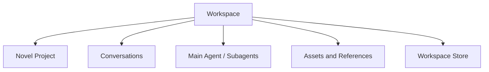
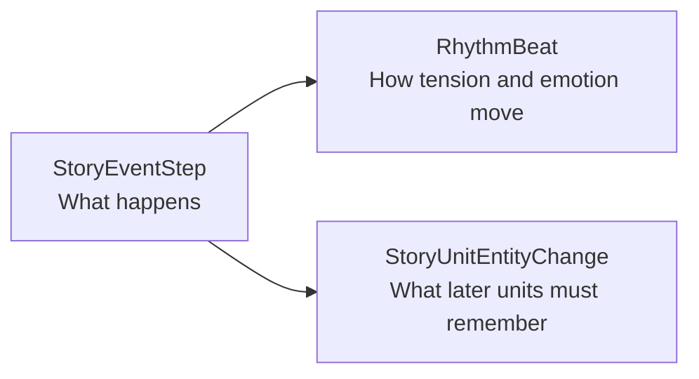
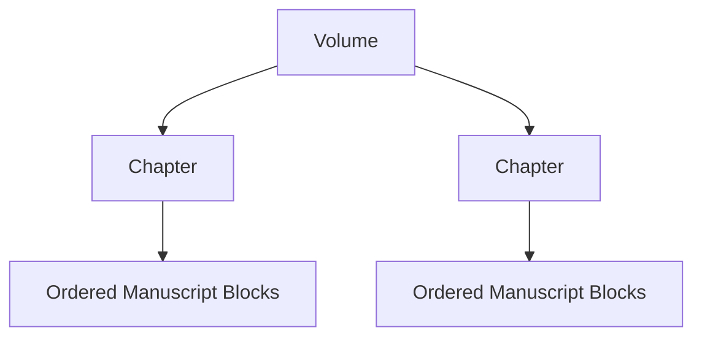
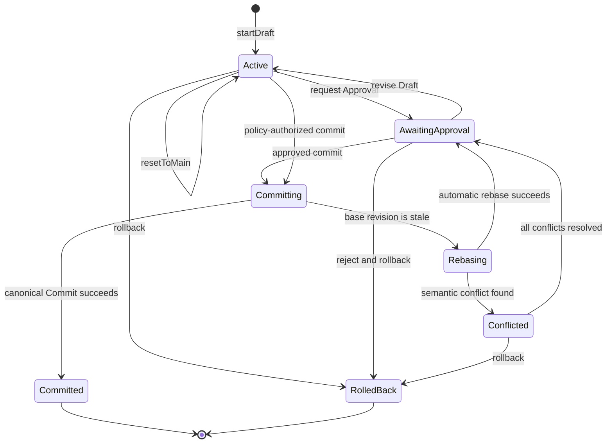
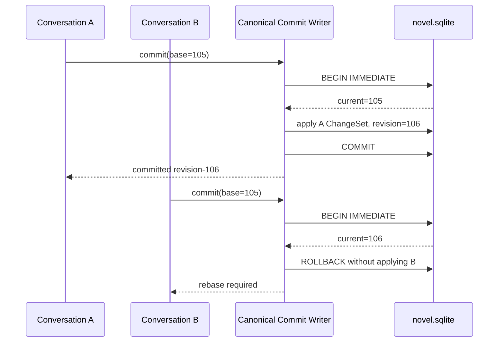
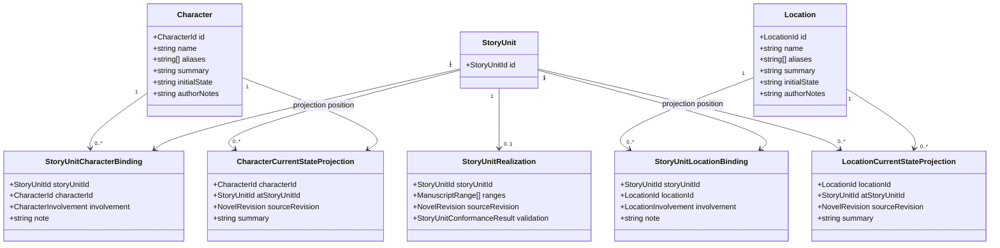
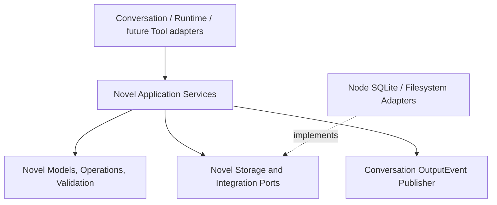
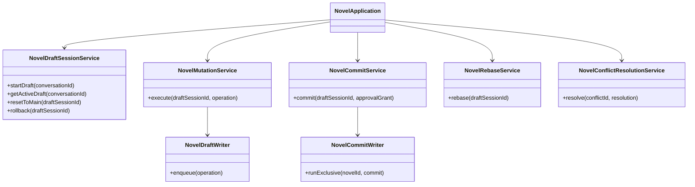

# Novel Domain Working Design

## 1. Document Status

This document records the current Novel-domain design discussion as of August 2, 2026.

- It is a working domain design, not an implementation claim.
- It does not add Novel-domain work to Runtime Task 1 through Task 7.
- Decisions marked **accepted direction** may be used in later Novel-domain planning.
- Decisions marked **current recommendation** still require review before implementation.

## 2. Workspace Boundary

**Accepted direction:** one Workspace corresponds to one Novel project.



- A Workspace owns one Novel project and may contain many Conversations.
- Main agents and subagents operate within the same Workspace access boundary unless explicitly granted read-only external references.
- The canonical Workspace identity remains independent from the physical work directory so an explicit rebind can preserve identity after a project move.
- A future series-level abstraction belongs above Workspace rather than allowing one Workspace to own multiple novels.

## 3. Separate Narrative, Manuscript, and Publication Structures

**Accepted direction:** story decomposition, written content, and publication organization are separate structures.


The Story Outline must not encode `Volume -> Chapter -> Scene` as its required hierarchy. Volume and Chapter are publication concepts, while the Story Outline is a narrative work-breakdown structure similar to a Todo tree.

## 4. Story Outline

### 4.1 Ordered StoryUnit Tree

**Accepted direction:** the outline is an ordered tree of stable `StoryUnit` nodes.

```ts
interface StoryUnit {
  readonly id: StoryUnitId;
  readonly outlineId: StoryOutlineId;
  readonly parentId?: StoryUnitId;
  readonly orderKey: OrderKey;

  readonly title: string;
  readonly intent?: string;
  readonly synopsis?: string;
}
```

- Core does not hard-code first-level, second-level, or third-level nodes.
- A node may be decomposed into smaller ordered child nodes at any time.
- A parent node expresses an aggregate narrative intention and summary rather than a traditional continuous scene.
- A leaf node is the smallest currently planned work unit, but it may later be decomposed without changing its stable identity.
- `StoryUnit` is preferred over calling every level `Scene`; higher-level nodes may represent an arc, sequence, investigation, relationship development, or another aggregate story unit.

An optional semantic scope may help presentation without determining hierarchy:

```ts
type StoryUnitScope =
  | "saga"
  | "arc"
  | "sequence"
  | "scene"
  | "custom";
```

The tree depth and `scope` are independent. User interfaces may show friendly level names without making those names persistence invariants.

### 4.2 Stable Ordering

**Accepted direction:** ordered siblings use stable IDs and opaque fractional ordering keys rather than array indexes or dense integers.

```ts
interface OrderKeyFactory {
  initial(): OrderKey;
  before(next: OrderKey): OrderKey;
  after(previous: OrderKey): OrderKey;
  between(previous: OrderKey, next: OrderKey): OrderKey;
}
```

- Moving a StoryUnit changes only its `parentId` and `orderKey`.
- Inserting a sibling does not renumber all later siblings.
- References always use stable IDs and never use outline paths or array indexes.
- Fractional indexing, LexoRank, or another variable-length lexical rank may implement `OrderKey` behind the stable contract.

#### OrderKey V1 Resolution

**Accepted V1 contract:** `OrderKey` is an opaque, non-empty uppercase
hexadecimal string composed of fixed-width four-character digits. Native string
comparison is the authoritative ordering operation.

```text
8000
4000
40008000
400080004000
```

- each encoded digit is in `0000` through `FFFF`; the final digit must not be
  `0000`, which preserves space after every valid prefix
- `initial()` returns `8000`
- `before(next)` and `after(previous)` delegate to the same midpoint algorithm
  as `between(previous, next)` with an open lower or upper boundary
- generation compares one digit at a time using implicit lower `0000` and
  upper `10000` sentinels; when adjacent digits leave no midpoint, generation
  keeps the lower digit and continues at the next depth
- factories reject malformed keys and reject `between(previous, next)` unless
  `previous < next`
- V1 performs no sibling rebalance and never rewrites another StoryUnit merely
  to insert or move one node; adversarial key growth is measured before a
  future explicit maintenance Operation is designed

The serialized representation is public only as an opaque value. Callers must
use the factory and comparator rather than construct semantic meaning from its
digits.

### 4.3 Agent-Assisted Rolling Outline

**Accepted direction:** the outline is collaboratively created by the human and Agent rather than manually completed by the human before writing begins.

The human contributes imagination, preferences, constraints, and creative judgment. The Agent may propose StoryUnits, decomposition, LeafStoryUnitPlan details, Character and Location bindings, Events, RhythmBeats, and entity changes. Tools validate identifiers, ordering, revisions, and structural invariants before accepted changes become authoritative outline state.

The entire novel does not need to reach `ready` before manuscript writing starts. Planning advances with a rolling horizon:

```text
Novel direction
    idea or outlined

Current arc
    outlined

Next executable leaf StoryUnits
    ready

Distant future StoryUnits
    idea
```

Only the leaf StoryUnit currently selected for manuscript execution must have an accepted plan that satisfies the configured ready policy.

Agent changes first enter an outline proposal rather than directly replacing accepted StoryUnits:

```ts
type ReviewStatus =
  | "proposed"
  | "accepted"
  | "rejected";

interface OutlineProposal {
  readonly id: OutlineProposalId;
  readonly baseRevision: NovelRevision;
  readonly operations: readonly OutlineOperation[];
  readonly reviewStatus: ReviewStatus;
}
```

- `baseRevision` prevents an Agent proposal based on stale outline state from overwriting newer decisions.
- `operations` apply one reviewable outline change set atomically after acceptance.
- A rejected proposal leaves accepted outline and manuscript state unchanged.
- V1 has no independent `OutlineRevision`; accepted operations advance the
  global `NovelRevision` exactly once per canonical Commit.
- Proposal origin and actor identity belong in audit metadata or Novel-domain Events rather than changing the semantics of the resulting StoryUnit.
- Once accepted, a StoryUnit has the same authority whether its content originated from the human, Agent, or a joint editing process.
- Conformance validation uses only accepted outline state; proposed changes cannot silently redefine the manuscript specification.

Recommended approval boundary:

- Agents may freely generate proposals, decomposition alternatives, missing-field suggestions, RhythmBeat suggestions, projections, and validation findings.
- Low-risk, repairable projection or indexing work may be auto-accepted by policy.
- Adding or removing required Events, changing entity consequences, moving accepted StoryUnits, modifying ready or realized leaf plans, abandoning StoryUnits, and marking realization complete require review under the configured approval policy.
- The Novel Domain does not auto-approve any ChangeSet. Automatic Approval, if
  an application later enables it, is an upper-layer policy; the default
  composition performs no automatic Approval.

## 5. StoryUnit Status and Reasons

**Accepted V1 contract:** a Todo-like outline needs status, but planning maturity, manuscript realization, and temporary blocking are separate concerns.

### 5.1 Planning and Realization Status

```ts
type StoryUnitPlanningStatus =
  | "idea"
  | "outlined"
  | "ready";

type StoryUnitRealizationStatus =
  | "pending"
  | "in-progress"
  | "completed"
  | "abandoned";
```

```ts
interface StoryUnit {
  readonly planningStatus: StoryUnitPlanningStatus;
  readonly realizationStatus: StoryUnitRealizationStatus;
  readonly blockState?: StoryUnitBlockState;
  readonly abandonment?: StoryUnitAbandonment;
}
```

Semantics:

- `planningStatus` answers whether the collaboratively produced narrative intention is sufficiently defined and accepted for writing; it does not identify whether the human or Agent authored the content.
- `realizationStatus` answers whether that intention has been accepted as realized in manuscript content.
- `pending` means manuscript realization has not started.
- `in-progress` means some realization exists or active drafting and revision work has started, but the StoryUnit is not accepted as complete.
- `completed` means its narrative intention has been expressed in manuscript content, the realization conforms to the current outline and manuscript revisions, and the result has been accepted by the author or workflow.
- `abandoned` means the author no longer intends to realize this StoryUnit; it remains addressable for history, replacement tracking, and possible restoration.
- Producing text does not automatically mean `completed`, and `completed` does not mean published or permanently immutable.

### 5.2 Blocking Is Independent

`blocked` is a temporary execution condition rather than a manuscript-realization phase. Keeping it outside `realizationStatus` preserves whether the StoryUnit was pending or already in progress when it became blocked.

```ts
type StoryUnitBlockReason =
  | "dependency"
  | "decision-required"
  | "continuity-conflict"
  | "missing-material"
  | "outline-incomplete"
  | "other";

interface StoryUnitBlockState {
  readonly reasonCode?: StoryUnitBlockReason;
  readonly note?: string;
  readonly dependencyIds: readonly StoryUnitId[];
  readonly blockedAt: string;
}
```

- `reasonCode` supports filtering, automation, and Agent routing.
- `note` is an optional human-readable explanation of the current blocking condition.
- `dependencyIds` identifies StoryUnits whose progress or decisions may unblock this unit.
- Clearing the block removes the current `blockState`; the historical transition remains in Novel-domain Events.
- an explicit `blockState` may be attached to a leaf or composite StoryUnit
- an ancestor block makes every active descendant effectively blocked without
  copying block state into those descendants
- a composite projection reports blocked-descendant counts separately; one
  blocked branch does not imply that every sibling branch is blocked
- dependency IDs are unique, may not reference the blocked StoryUnit itself,
  and must resolve inside the same StoryOutline when the state is accepted

### 5.3 Abandonment Information

An abandoned StoryUnit retains a structured reason and may point to the StoryUnit that replaced it.

```ts
type StoryUnitAbandonReason =
  | "story-direction-changed"
  | "replaced"
  | "merged"
  | "duplicate"
  | "scope-reduced"
  | "other";

interface StoryUnitAbandonment {
  readonly reasonCode?: StoryUnitAbandonReason;
  readonly note?: string;
  readonly replacementStoryUnitId?: StoryUnitId;
  readonly abandonedAt: string;
}
```

- `note` explains why the author abandoned the unit without overloading a generic status note.
- `replacementStoryUnitId` prevents replacement from being interpreted as simple deletion and helps Agents avoid proposing an obsolete direction again.
- `abandonment` is required while `realizationStatus` is `abandoned` and is cleared from current state if the unit is restored.
- abandoning a composite StoryUnit does not rewrite descendant current state;
  descendants become effectively excluded through the abandoned ancestor and
  become visible with their preserved state if that ancestor is restored
- replacement targets must belong to the same StoryOutline and may not be the
  abandoned StoryUnit or one of its descendants

Recommended current-state invariants:

```text
realizationStatus = pending | in-progress
    blockState may be present

realizationStatus = completed
    blockState and abandonment are absent

realizationStatus = abandoned
    abandonment is present
    blockState is absent
```

### 5.4 Composite Progress

Leaf realization status may be stored directly. Composite progress should normally be exposed as a derived roll-up rather than maintained as a conflicting second source of truth.

```ts
interface StoryUnitProgressProjection {
  readonly storyUnitId: StoryUnitId;
  readonly effectiveStatus: StoryUnitRealizationStatus;
  readonly isBlocked: boolean;
  readonly completedLeafCount: number;
  readonly totalLeafCount: number;
}
```

Composite progress uses active leaf descendants as its source of truth:

- effectively abandoned leaves are excluded from active totals
- all active leaves completed means the composite is effectively completed
- any active leaf in progress, or a mix of completed and pending leaves, means
  the composite is effectively in progress
- otherwise the composite is effectively pending
- a directly or ancestrally abandoned composite is effectively abandoned

Direct block state, ancestor blocking, and blocked-descendant counts remain
separate projection fields so aggregate progress does not erase the actual
execution constraint.

### 5.5 Status History

Current StoryUnit fields expose current state; Novel-domain Events preserve transition history:

```text
StoryUnitBlocked
StoryUnitUnblocked
StoryUnitAbandoned
StoryUnitRestored
```

Domain persistence may retain reason notes in these Events. Structured Runtime logs must only record safe identifiers and lifecycle metadata and must not emit the natural-language note content.

## 6. Leaf StoryUnit Plan

**Accepted V1 contract:** a leaf StoryUnit is the smallest currently executable writing specification. It describes time, participating Characters and Locations, objective Events, intended emotional rhythm, and the persistent entity changes that the manuscript must realize.

```ts
interface LeafStoryUnitPlan {
  readonly storyUnitId: StoryUnitId;
  readonly settingMode: StorySettingMode;
  readonly time?: StoryTimeDescription;
  readonly characters: readonly StoryUnitCharacterBinding[];
  readonly locations: readonly StoryUnitLocationBinding[];
  readonly events: readonly StoryEventStep[];
  readonly rhythmBeats: readonly RhythmBeat[];
  readonly entityChanges: readonly StoryUnitEntityChange[];
}
```

```ts
type StorySettingMode =
  | "located"
  | "location-independent";
```

A leaf plan answers five questions:

1. When does this unit happen?
2. Where does it happen?
3. Which Characters participate or are affected?
4. What objectively happens, and how should emotional tension rise or fall?
5. What persistent Character or Location changes must later StoryUnits remember?

The plan is progressively populated by human and Agent collaboration:

- `idea` may contain only title and intent.
- `outlined` may contain partial time, bindings, Events, rhythm, and entity changes.
- `ready` means the accepted leaf plan satisfies a Tool-enforced readiness policy and may be used as the manuscript specification.

RhythmBeats remain optional. Character or Location bindings and entity changes
may be empty when the StoryUnit semantics do not require them.

**Accepted V1 ready policy:** a StoryUnit may enter `ready` only when:

- it is currently a leaf StoryUnit
- it has a usable `StoryTimeDescription`
- it has at least one objective `StoryEventStep`
- `settingMode = located` has exactly one Location binding whose role is
  `primary`
- `settingMode = location-independent` has no `primary` Location binding;
  secondary or mentioned references remain allowed
- every Character, Location, Event, RhythmBeat, and EntityChange reference is
  structurally valid and belongs to the same StoryUnit plan

Contextual Character or Location profile insufficiency produces a repairable
readiness finding but does not block the V1 baseline `ready` state. A stricter
Agent definition may refuse manuscript execution until additional profile
findings are resolved, but it does not redefine the stored baseline readiness
contract.

If a leaf StoryUnit is decomposed into children, its detailed plan must be migrated, summarized, or archived through an accepted proposal rather than silently duplicated across parent and child nodes.

### 6.1 Story Time

**Accepted V1 contract:** Story time remains a human-readable narrative
description with optional coarse chronological ordering.

```ts
interface StoryTimeDescription {
  readonly description: string;
  readonly timelineOrderKey?: OrderKey;
}
```

- `description` permits natural-language time such as `the following morning` or `ten years earlier`.
- `timelineOrderKey` is optional initial support for story-world chronology that differs from outline or manuscript order.
- The initial model does not require a complete calendar system.
- `description` is required, trimmed, and non-blank when a time description is
  present; Core does not parse it into calendar facts
- `timelineOrderKey` uses the same opaque `OrderKey` representation but belongs
  to a separate StoryTimeline ordering namespace
- equal timeline keys are allowed for simultaneous or deliberately unordered
  StoryUnits; deterministic queries use StoryUnit ID as the final tie-breaker
- absence of `timelineOrderKey` means chronologically unplaced rather than
  chronologically last
- the initial `ready` policy requires a usable description but does not require
  a timeline key

### 6.2 StoryEventStep

`StoryEventStep` describes what objectively happens.

```ts
interface StoryEventStep {
  readonly id: StoryEventStepId;
  readonly storyUnitId: StoryUnitId;
  readonly orderKey: OrderKey;
  readonly description: string;
}
```

Events are ordered implementation requirements for the manuscript. They do not directly describe emotional rhythm and do not need independent Todo lifecycle state.

### 6.3 RhythmBeat

`RhythmBeat` describes intended emotion, tension, turning points, climax, release, and aftermath. It does not describe the objective Event itself.

```ts
type RhythmDirection =
  | "setup"
  | "rise"
  | "hold"
  | "turn"
  | "climax"
  | "fall"
  | "release"
  | "aftermath";

type RhythmIntensity = 1 | 2 | 3 | 4 | 5;

interface RhythmBeat {
  readonly id: RhythmBeatId;
  readonly storyUnitId: StoryUnitId;
  readonly orderKey: OrderKey;
  readonly rhythm: RhythmDirection;
  readonly intensity: RhythmIntensity;
  readonly readerEmotion?: string;
  readonly pointOfViewEmotion?: string;
  readonly description?: string;
  readonly relatedEventIds: readonly StoryEventStepId[];
}
```

- `readerEmotion` expresses the intended reader experience.
- `pointOfViewEmotion` expresses the point-of-view Character's experience; it may intentionally differ from reader emotion.
- `relatedEventIds` identifies which objective Events carry the rhythm point.
- RhythmBeat is optional, carries no Todo status, owns no manuscript content, and cannot be promoted into a child StoryUnit.
- If an Event or leaf StoryUnit becomes too complex, the Event or StoryUnit is decomposed and its RhythmBeats are replanned.

### 6.4 StoryUnitEntityChange

`StoryUnitEntityChange` describes what later StoryUnits must remember after this unit is realized.

```ts
type StoryEntityChangeCategory =
  | "identity"
  | "condition"
  | "location"
  | "relationship"
  | "knowledge"
  | "goal"
  | "ownership"
  | "environment"
  | "custom";

interface StoryUnitEntityChange {
  readonly id: StoryUnitEntityChangeId;
  readonly storyUnitId: StoryUnitId;
  readonly entityType: "character" | "location";
  readonly entityId: StoryEntityId;
  readonly relatedEntityId?: StoryEntityId;
  readonly category: StoryEntityChangeCategory;
  readonly summary: string;
  readonly sourceEventIds: readonly StoryEventStepId[];
}
```

- Character relationships are recorded only as sparse, story-relevant changes with an optional `relatedEntityId`; the initial model does not maintain a complete pairwise relationship graph.
- Location changes use the same mechanism for damage, ownership, access, environmental condition, and other persistent consequences.
- The model maintains one authoritative entity-change specification per StoryUnit. It does not preserve separate long-lived `expectedChanges` and `actualChanges` truth sets.



## 7. Manuscript Organization

**Accepted direction:** written content uses stable content Blocks organized by publication containers.

```ts
interface ParagraphBlock {
  readonly id: ManuscriptBlockId;
  readonly manuscriptId: ManuscriptId;
  readonly chapterId: PublicationChapterId;
  readonly orderKey: OrderKey;
  readonly text: string;
}
```

- One Novel-owned Manuscript binds one PublicationStructure in V1.
- Paragraph is the initial persistent editing unit.
- Sentence is not a persistent domain entity; precise operations use offsets within a Block.
- Chapter is an ordered container of Manuscript Blocks rather than a fragile global array-index range.
- Volume is an ordered container of Chapters.
- StoryUnit does not become owned by Chapter merely because its realization appears in that Chapter.
- Block IDs are unique across the Manuscript, while OrderKeys are unique among Blocks in the same Chapter.
- Canonical traversal follows Publication Volume order, Chapter order, then Chapter-local Block order.
- Empty Paragraph text is valid while a Draft incrementally realizes an outline leaf.



## 8. Manuscript Anchors, Realization, and Conformance

StoryUnits associate with written content through stable Block anchors:

```ts
interface ManuscriptAnchor {
  readonly blockId: ManuscriptBlockId;
  readonly boundary: "before" | "after";
}

interface ManuscriptRange {
  readonly start: ManuscriptAnchor;
  readonly end: ManuscriptAnchor;
}

interface StoryUnitRealization {
  readonly storyUnitId: StoryUnitId;
  readonly ranges: readonly ManuscriptRange[];
  readonly sourceRevision: NovelRevision;
  readonly validation: StoryUnitConformanceResult;
}
```

- Ranges never use array indexes.
- Within one Block, the `before` boundary sorts before the `after` boundary.
- Across Blocks, boundary order follows canonical Volume, Chapter, and Block order.
- Equal start and end anchors form a valid empty Range; only inverted order is rejected.
- Blocks inserted between existing anchors are naturally included according to current order.
- Anchor bias determines whether insertion at an exact boundary belongs inside or outside a range.
- One StoryUnit may realize across multiple ranges and Chapters.
- Node movement in the outline does not invalidate manuscript realization because the StoryUnit ID remains stable.

The manuscript is an implementation of the StoryUnit specification rather than an independent source of alternate story facts. A realization records where the StoryUnit is implemented and whether that content conforms to the current outline.

```ts
type StoryUnitConformanceStatus =
  | "pending"
  | "conforming"
  | "non-conforming"
  | "stale";

type StoryUnitConformanceFindingType =
  | "missing-event"
  | "unexpected-event"
  | "character-mismatch"
  | "location-mismatch"
  | "time-mismatch"
  | "missing-entity-change"
  | "contradictory-entity-change"
  | "rhythm-mismatch"
  | "other";

interface StoryUnitConformanceFinding {
  readonly type: StoryUnitConformanceFindingType;
  readonly severity: "warning" | "error";
  readonly note: string;
  readonly manuscriptRanges: readonly ManuscriptRange[];
}

interface StoryUnitConformanceResult {
  readonly status: StoryUnitConformanceStatus;
  readonly checkedNovelRevision: NovelRevision;
  readonly findings: readonly StoryUnitConformanceFinding[];
}
```

Conformance semantics:

- `pending` means the current manuscript ranges have not yet been checked.
- `conforming` means the manuscript satisfies the current StoryUnit Events, entity changes, Character and Location bindings, time requirements, and accepted rhythm expectations.
- `non-conforming` means required semantics are missing, contradicted, or changed by the manuscript.
- `stale` means either the relevant outline or manuscript changed after validation.
- Additional prose detail is allowed when it does not create a conflicting persistent story fact.
- A new semantic Event or entity change must either be removed from the manuscript or explicitly added to the outline through an accepted outline mutation before validation can succeed.

A StoryUnit may enter `realizationStatus: completed` only when it has at least one current ManuscriptRange and a `conforming` validation checked against the current global NovelRevision. Conformance failure keeps the StoryUnit in progress; it does not create an alternate actual-facts table.

`ManuscriptRange` uses half-open `[start, end)` semantics. Both anchors belong
to the same Manuscript and reference stable Block boundaries. V1 does not
define character-offset anchors or an independent `ManuscriptRevision`.

If the human changes creative direction, or accepts an Agent proposal that changes it while drafting, the outline is explicitly revised and the manuscript is revalidated. The model treats this as a specification change rather than silent manuscript divergence.

Deletion and structural edits require reference preservation:

- Deleted Blocks first become tombstones rather than disappearing while references still exist.
- Splitting a Block preserves one stable ID and records how anchors transform into the new Block.
- Merging Blocks retains a stable target and records a redirect from removed IDs.
- Moving a Block preserves its ID and changes only its container and ordering key.
- Invalid, inverted, disconnected, or orphaned ranges must be surfaced for repair rather than silently reinterpreted.

## 9. Publication Relationship

Chapter and Volume are publication structures whose actual authority is written content.

- A Chapter owns an ordered collection of Manuscript Blocks.
- A Chapter may also have optional planned StoryUnit coverage before content exists.
- Planned StoryUnit coverage answers what the chapter intends to contain; Manuscript Blocks answer what it actually contains.
- A Volume owns ordered Chapters, and its actual manuscript coverage is derived from them rather than duplicated as another authoritative range.
- A Volume may reference a primary higher-level StoryUnit for narrative intent, but that association is not its content boundary.

## 10. Multi-Conversation Draft and Commit Model

**Accepted direction:** proceed directly with independent Conversation Drafts, optimistic rebasing, and explicit conflict resolution rather than restricting a Novel to one active writable Draft. The initial Novel implementation still uses serialized domain operations and revision checks rather than making the whole domain a CRDT.

### 10.1 Canonical and Draft Databases

The Workspace owns one canonical Novel database and may contain multiple active Draft Sessions:

```text
novel.sqlite
    accepted canonical Novel state

Conversation A
    -> DraftSession A
    -> draft-a.sqlite based on revision-105

Conversation B
    -> DraftSession B
    -> draft-b.sqlite based on revision-105
```

- `novel.sqlite` is the sole authority for accepted Novel state, Commit existence, and the current NovelRevision.
- Each top-level Conversation may own at most one active writable `NovelDraftSession`.
- Multiple top-level Conversations may own independent Draft Sessions concurrently.
- A subagent participating in its parent Conversation's work shares the parent's Draft Session through the same serialized Draft Writer unless it is explicitly started as a separate top-level branch.
- Every Draft Session owns a durable `draft.sqlite` working copy initialized from one exact canonical `baseRevision`.
- Agent Turns, Provider calls, Tool calls, Approval waits, process restarts, and host replacement may occur while the Draft Session remains active.
- No long-lived SQLite transaction or connection spans those boundaries. Each Draft operation uses a short transaction against its own `draft.sqlite`.
- `draft.sqlite` is never copied over the canonical database file. Final publication replays a validated Domain ChangeSet inside a short canonical SQLite transaction.

Recommended storage shape:

```text
storeDir/
├── runtime.sqlite
├── novel.sqlite
├── novel-staging/
│   ├── conversation-a/
│   │   └── draft-session-a/
│   │       ├── manifest.json
│   │       ├── draft.sqlite
│   │       └── artifacts/
│   └── conversation-b/
│       └── draft-session-b/
│           ├── manifest.json
│           ├── draft.sqlite
│           └── artifacts/
└── novel-history/
    └── commits/
```

The staging directory is durable Store state rather than operating-system temporary storage. A host restart must discover and reopen active Draft Sessions instead of treating their files as disposable process cache.

### 10.2 Draft Session Lifecycle

```ts
type NovelDraftSessionStatus =
  | "active"
  | "awaiting-approval"
  | "rebasing"
  | "conflicted"
  | "committing"
  | "committed"
  | "rolled-back";

interface NovelDraftSession {
  readonly id: NovelDraftSessionId;
  readonly novelId: NovelId;
  readonly ownerConversationId: ConversationId;
  readonly baseRevision: NovelRevision;
  readonly status: NovelDraftSessionStatus;
}
```

Public lifecycle semantics:

- `startDraft()` creates a new Draft Session from the current canonical revision. It must not overwrite or silently reset an existing active Draft owned by the same Conversation.
- `getActiveDraft()` reopens the Conversation's existing Draft across Agent Turns or process restarts.
- `commit()` freezes the current ChangeSet and attempts to publish it to `novel.sqlite`.
- `rollback()` abandons the whole Draft Session, removes its unpublished working state after durable terminal marking, and returns the Conversation to no-active-Draft state.
- `resetToMain()` deliberately discards local Draft changes, recreates the Draft from the latest canonical revision, and keeps the Draft Session active with a new base revision.
- A successful Commit ends that Draft Session. Further editing starts a new Draft Session, even when the same Conversation continues.
- `sync()` is not a public operation because its direction and data-loss behavior are ambiguous. `commit()`, `rollback()`, and `resetToMain()` express the intended direction explicitly.
- A committed Draft cannot be rolled back. Reversing accepted state requires a future compensating Novel Commit rather than history deletion.



### 10.3 Domain Operation Journal and Draft Projection

All Draft writes are represented as serializable, versioned Domain Operations. A Draft operation is not a closure, raw SQL statement, Provider request, or instruction to regenerate content later.

The canonical Operation digest contract is accepted as follows:

```text
canonicalStringifyJson(complete Operation envelope)
    -> UTF-8 bytes
    -> SHA-256
    -> "sha256:" + 64 lowercase hexadecimal characters
```

- The complete envelope includes `operationId`, `operationVersion`, `type`, `expected`, and `payload`.
- Canonical JSON sorts object keys using the shared Core canonical serializer.
- Array order is preserved and participates in the digest, including precondition order.
- Operation producers therefore construct semantically equivalent precondition arrays in a stable order.
- The prefixed digest is the durable identity used by the Draft Journal, ChangeSet, Commit, and Rebase protocols.

```ts
interface NovelOperationBase {
  readonly operationId: NovelOperationId;
  readonly operationVersion: number;
  readonly type: string;
  readonly expected: readonly NovelOperationPrecondition[];
}

interface NovelOperationPrecondition {
  readonly entityType: NovelEntityType;
  readonly entityId: string;
  readonly fieldPath?: string;
  readonly expectedDigest?: string;
  readonly expectedEntityRevision?: EntityRevision;
}
```

- Generated IDs, timestamps, model-produced text, random choices, and other nondeterministic results are fixed before the Operation is accepted into the Draft.
- Large text or binary values may be stored as immutable Draft Artifacts referenced by logical ID and digest rather than duplicated inside every Operation.
- Preconditions record the state against which the Operation was authored and permit field-, entity-, Block-, parent-, and ordering-level conflict detection during Rebase.
- A Draft Writer serializes Main Agent, shared Subagent, and user Tool writes for one Draft Session.
- One short `draft.sqlite` transaction validates the Operation, records it in a Draft Operation table, applies it to Draft domain tables, updates Draft metadata, and commits. This keeps the Operation Journal and queryable Draft state atomic without coordinating a JSONL append with SQLite.
- The Draft Operation table is the recoverable unpublished ChangeSet source. `draft.sqlite` also provides read-your-own-writes queries, previews, tree traversal, relationship queries, and full-text access.
- Final Commit history may serialize the frozen Operation payload into an immutable history file referenced by canonical Commit metadata and protected by digest and size checks.

The effective model is:

```text
base canonical revision
    + ordered Draft Domain Operations
    = queryable draft.sqlite state
```

Before canonical Commit, the effective ordered Draft sequence is frozen into a
versioned ChangeSet identity. Its SHA-256 digest covers `novelId`,
`baseRevision`, operation count, last sequence, and the ordered
`{ sequence, operationDigest }` entries. Draft Session identity and freeze time
remain durable metadata but do not participate in the content digest. The
freeze shares the per-Draft Writer queue and uses a SQLite compare-and-set, so
later Operations cannot join the approved sequence. This identity contract is
independent from the still-deferred immutable Commit history file encoding.

### 10.4 Canonical Commit Protocol

All canonical Commits for one Novel pass through one asynchronous Commit Writer and are serialized even when their Drafts were edited concurrently.

```text
1. Freeze the Draft Operation sequence.
2. Wait for that Draft's Writer Queue to drain.
3. Validate Draft integrity and construct an immutable ChangeSet.
4. Calculate the ChangeSet digest.
5. Verify that any required Approval grants that exact digest.
6. Acquire the per-Novel Commit Writer lock.
7. Open a short `BEGIN IMMEDIATE` transaction on novel.sqlite.
8. Compare current NovelRevision with the Draft baseRevision.
9. Replay all Domain Operations and validate final domain invariants.
10. Insert Commit metadata and its immutable payload reference.
11. Increment NovelRevision exactly once.
12. Insert the Novel outbox record.
13. Commit the SQLite transaction.
14. Mark the Draft Session committed and clean or archive its staging data.
```

Any Operation or invariant failure rolls back the complete canonical SQLite transaction. The canonical database therefore observes either the whole ChangeSet or none of it. A Draft may contain many short local transactions while still producing exactly one canonical NovelRevision increment.

Canonical Commit history uses one immutable external canonical-JSON payload per
Commit at `novel-history/commits/<commitId>.json`. The UTF-8 bytes contain the
versioned Commit identity, source Draft and owner, base and result revisions,
ChangeSet digest, committed timestamp, and the complete ordered Operations with
their digests. The file has no trailing newline; its SHA-256 digest and exact
byte size are stored in `novel_commits`, whose row remains Commit authority.

Preparation uses an exclusively created same-directory temporary file, file
fsync, atomic rename, and directory fsync before the canonical SQLite
transaction. Existing identical final files are reused; mismatches are identity
conflicts. The Commit transaction re-verifies the regular file, safe basename,
size, and digest before recording it. Serialized recovery removes recognized
temporary files and unreferenced final files. A missing referenced file never
rolls back accepted Novel state: it is regenerated only from a preserved frozen
Draft with the same ChangeSet digest, otherwise a fixed history-integrity error
is exposed without fabricating history.

Direct replacement of `novel.sqlite` with a Draft file is excluded. File replacement would not safely compose with active readers, WAL state, Commit metadata, outbox publication, schema validation, or future process placement.

### 10.5 Revision Staleness and Rebase

Suppose two Drafts start from the same accepted state:

```text
Conversation A Draft: baseRevision = revision-105
Conversation B Draft: baseRevision = revision-105
```

If A commits first, canonical state advances to `revision-106`. B's later Commit attempt detects a stale base and must not overwrite A. Revision staleness alone is not a semantic conflict; it requires Rebase.



Rebase creates a new working copy from the latest canonical revision and replays the stale Draft's Operations in order:

```text
1. Preserve the original Draft unchanged.
2. Snapshot the latest canonical revision into a sibling rebase Draft.
3. Replay each stale Draft Operation with its original preconditions.
4. Record semantic conflicts instead of forcing an overwrite.
5. Validate the rebuilt Draft and its final invariants.
6. If conflict-free, atomically promote the rebuilt Draft and update baseRevision.
7. If conflicted, preserve both the original Draft and the rebase candidate for resolution.
```

- Non-overlapping Operations rebase automatically.
- Operations on the same entity may still merge automatically when they modify independent fields and preserve domain invariants.
- Equivalent idempotent Operations may collapse to no-ops.
- Rebase must not mutate the original Draft in place; failure or process interruption leaves recoverable source state.
- Rebase changes the effective ChangeSet digest. Any Approval granted before Rebase becomes stale even when Rebase finds no semantic conflict.
- A resolved sibling is promoted through one canonical SQLite transaction: the
  preserved source Draft becomes `conflicted`, the sibling becomes the owner's
  `active` writable Draft, and the resolved-candidate registry records the
  promotion timestamp. `conflicted` predecessors remain inspectable but do not
  occupy the one-active-writable-Draft uniqueness slot.
- Promotion is retry-stable across restart and never transfers Approval. The
  promoted sibling freezes and approves its own ChangeSet identity.

The SQLite snapshot and publication protocol used by both `startDraft()` and
Rebase is accepted as follows:

- A snapshot is created with the SQLite Backup API from a read-only canonical
  connection. Copying `novel.sqlite`, `-wal`, and `-shm` files directly is
  forbidden.
- The target is first assembled in a recognized same-parent temporary
  directory. Its database is migrated to the Draft schema and validated for
  integrity, Novel identity, Draft identity, owner identity, and exact base
  revision before publication.
- The database file, manifest, temporary directory, and parent directory are
  synced in that order where the host filesystem exposes directory fsync.
- Publication is one atomic rename from the temporary sibling directory to the
  final Draft directory. An existing final identity is never overwritten.
- Startup reconciliation removes only recognized incomplete snapshot
  directories. Unknown files and directories are preserved for diagnosis.
- A Rebase candidate has a new Draft Session identity and an explicit source
  Draft identity. It is stored as a sibling snapshot and as a separate
  canonical Rebase Candidate record; it does not become a second active
  Conversation Draft merely by being prepared.
- The source Draft remains byte-for-byte and lifecycle-state unchanged while
  the candidate is prepared. The candidate becomes durable only after all
  source Operations have replayed in original order with their original
  preconditions and digests.
- Failure before candidate registration removes the incomplete candidate and
  leaves the source Draft recoverable. Semantic precondition failures are not
  converted into overwrites; Task N7-B records them as `NovelConflict` values.

### 10.6 Conflict Model and Resolution

```ts
type NovelConflictKind =
  | "field-modified"
  | "entity-deleted"
  | "entity-created"
  | "parent-changed"
  | "order-changed"
  | "manuscript-block-modified"
  | "domain-invariant";

interface NovelConflict {
  readonly id: NovelConflictId;
  readonly draftSessionId: NovelDraftSessionId;
  readonly operationId: NovelOperationId;

  readonly kind: NovelConflictKind;
  readonly entityType: NovelEntityType;
  readonly entityId: string;
  readonly fieldPath?: string;

  readonly baseDigest?: string;
  readonly canonicalDigest?: string;
  readonly draftDigest?: string;
}

type NovelConflictResolution =
  | { readonly strategy: "keep-canonical" }
  | { readonly strategy: "keep-draft" }
  | { readonly strategy: "drop-operation" }
  | {
      readonly strategy: "manual";
      readonly replacement: NovelOperation;
    };
```

The initial Conflict digest protocol is accepted as follows:

- `baseDigest` is SHA-256 over canonical JSON containing the exact original
  Operation precondition. It represents the state assumption under which the
  Operation was authored without reconstructing unavailable historical text.
- `canonicalDigest` and `draftDigest` are SHA-256 over canonical version-1
  entity snapshot envelopes. The envelope identifies entity type, stable ID,
  presence state, and the complete current entity projection when present.
- Entity content exists only transiently inside the Node digest adapter. Draft
  Conflict rows, canonical candidate records, application values, errors, and
  logs retain only `sha256:<64 lowercase hex>` values.
- `conflictDigest` is SHA-256 over canonical JSON of the complete safe Conflict
  envelope: version, IDs, source Operation sequence, unresolved status, kind,
  entity identity, optional field path, the three snapshot digests, and the
  creation timestamp.
- Rebase persists a conflicting source sequence in `draft_conflicts`, skips
  applying that Operation, and continues scanning later source Operations.
  Successfully applied Operations preserve their relative source order; the
  source Draft remains the complete authoritative unpublished Operation list
  until resolution.
- Character and Location full-profile replacement conflicts use
  `fieldPath = "profile"`. Missing canonical entities map to
  `entity-deleted`, unexpected canonical entities map to `entity-created`,
  version mismatch maps to `field-modified`, and reference/invariant rejection
  maps to `domain-invariant`.

Conflict granularity follows stable domain identities:

| Canonical change | Draft change | Default result |
| --- | --- | --- |
| Different entities | Different entities | Automatic Rebase |
| Same entity, independent fields | Independent fields | Automatic Rebase when invariants hold |
| Same field | Same field | Conflict |
| Delete entity | Update entity | Conflict |
| Delete parent StoryUnit | Create or move child below it | Conflict |
| Create distinct stable IDs | Create distinct stable IDs | Automatic Rebase |
| Create same stable ID | Create same stable ID | Idempotent no-op or conflict after payload comparison |
| Move different StoryUnits | Move different StoryUnits | Usually automatic Rebase |
| Move same StoryUnit | Move same StoryUnit | Conflict |
| Edit different Manuscript Blocks | Edit different Blocks | Automatic Rebase |
| Edit same Manuscript Block | Edit same Block | Conflict |

Conflict resolution produces new or replacement Domain Operations; it never patches canonical state outside the normal Commit path. `keep-draft` is still subject to permission, invariant, and conformance validation rather than meaning unconditional overwrite.

Resolution decisions are durable versioned records before they are applied:

- one Conflict accepts exactly one `keep-canonical`, `keep-draft`,
  `drop-operation`, or `manual` decision
- `manual` contains one fully captured replacement Domain Operation; the other
  strategies contain no hidden payload
- canonical JSON plus SHA-256 gives the decision an idempotent durable identity
- `draft_conflicts` changes from `unresolved` to `resolved` in one short
  transaction and stores the exact decision JSON, digest, and timestamp
- an exact retry is a duplicate success; a different decision for an already
  resolved Conflict is an invariant failure
- recording a decision does not itself mutate the candidate projection;
  strategy application and resolved-candidate rebuilding remain a separate
  serialized Operation step

Before any strategy mutates a projection, all source Operations and durable
decisions are compiled into one immutable Resolution Application Plan:

- every source Operation sequence produces exactly one ordered entry
- non-conflicting Operations remain `apply-original`
- `keep-canonical` and `drop-operation` remain distinct audited `skip` entries
- `manual` stores its captured replacement as `apply-replacement`
- `keep-draft` passes through a platform-neutral planner that returns either a
  validated replacement Operation or an explicit no-op
- plan identity hashes only stable metadata, ordering, actions, strategies,
  Conflict identities, and Operation digests; full Operation payloads retain
  their independent Operation digest protection
- the candidate Draft SQLite database stores the plan metadata and all entries
  in one short transaction; exact retry is a duplicate success and a different
  plan for the same candidate is an identity conflict
- restart reconstruction revalidates canonical JSON, source ordering, counts,
  Operation digests, and the plan digest before returning the plan

The plan does not append replacements to the partially replayed conflicted
candidate. A later serialized step replays the complete ordered plan against a
fresh canonical snapshot into a new sibling candidate.

Character and Location `keep-draft` uses a platform-neutral rebinding strategy
rather than reading the final partial candidate as if it represented every
source sequence. The resolved-candidate replayer supplies the entity state that
exists immediately before the conflicting source Operation:

- conflicting create becomes replace against the current entity version, or a
  no-op when the stable profile already matches
- conflicting replace becomes create when the entity was deleted, otherwise
  replace against the current entity version or a matching-profile no-op
- conflicting delete becomes delete against the current entity version, or a
  no-op when the entity is already absent
- unsupported Conflict kind, entity identity, or Operation type combinations
  are rejected instead of guessed

This sequence-local state is required when several source Operations touch the
same entity: preconditions for a later replacement must observe earlier
effective Operations, not the final state of a partially replayed candidate.

A successfully rebuilt sibling is registered separately from both its source
Draft and conflicted candidate. The canonical registry records the Resolution
Plan digest and effective Operation count, while all three Draft directories
retain distinct stable identities. Registry identity is immutable per
conflicted candidate and survives restart; creating another resolved identity
for the same conflicted candidate is rejected.

Resolved rebuilding is fail-closed: canonical revision must still equal the
Resolution Plan base, a fresh sibling snapshot receives effective entries in
source order, and its Operation Journal is verified before registry publication.
An interrupted or rejected replay removes only the unregistered sibling; the
source Draft, conflicted candidate, decisions, and plan remain recoverable.

### 10.7 Approval Binding

Approval grants bind to an immutable ChangeSet identity rather than only a Draft Session ID:

```ts
interface NovelChangeSetApprovalRequest {
  readonly draftSessionId: NovelDraftSessionId;
  readonly baseRevision: NovelRevision;
  readonly changeSetDigest: string;
  readonly operationIds: readonly NovelOperationId[];
}
```

- Appending, replacing, disabling, or resolving an Operation changes the effective ChangeSet digest and invalidates previous Approval.
- A successful Rebase changes the base revision and invalidates previous Approval even if every Operation replayed automatically.
- The Approval UI may show semantic summaries and load detailed values or manuscript Artifacts on demand; approval identity remains the digest.
- Canonical Commit verifies the Approval grant after acquiring the Commit Writer lock and before applying the ChangeSet.

The initial durable Approval protocol is Draft-local and versioned:

- the grant records `draftSessionId`, `baseRevision`, exact ChangeSet digest,
  ordered Operation IDs, grant timestamp, canonical JSON, and SHA-256 identity
- one active grant exists per Draft database; an exact retry is a duplicate,
  while a new grant supersedes the previous active record without deleting its
  audit history
- explicit invalidation records a safe fixed reason such as
  `base-revision-changed`, `change-set-changed`, `draft-replaced`, or `revoked`
- when Approval enforcement is enabled, Commit Writer verifies the grant inside
  the per-Novel serialized section before preparing history or mutating canonical
  state
- successful Rebase invalidates the preserved source Draft grant before
  publishing the candidate registry; resolved siblings have distinct Draft
  identities and therefore cannot inherit predecessor Approval
- Novel ChangeSet Approval remains independent from Runtime Tool Approval and
  does not reuse Tool interaction records or permission decisions

### 10.8 Preserved Domain Mutation Rules

- Fractional ordering keys handle frequent sibling and paragraph insertion.
- Stable IDs preserve references across movement and permit fine-grained conflict detection.
- Tombstones and redirects preserve references across deletion, splitting, and merging.
- Optimistic NovelRevision checks prevent stale Drafts from overwriting accepted state.
- Domain Operation preconditions distinguish revision staleness from real semantic conflict.
- A future collaborative editor may introduce CRDT behavior at the Paragraph text adapter boundary without changing the whole Novel domain contract.

## 11. Minimal Progressive Character and Location Models

**Current recommendation:** Character and Location records begin as minimal stable identities and are progressively enriched by human and Agent collaboration only when upcoming StoryUnits need more information. Leaf StoryUnits remain responsible for participation, Events, rhythm, and changing narrative state. Tools may derive reviewable readiness and current-state projections from those sources.

### 11.1 Minimal Contracts

```ts
interface Character {
  readonly id: CharacterId;
  readonly name: string;
  readonly aliases: readonly string[];
  readonly summary?: string;
  readonly initialState?: string;
  readonly authorNotes?: string;
}

interface Location {
  readonly id: LocationId;
  readonly name: string;
  readonly aliases: readonly string[];
  readonly summary?: string;
  readonly initialState?: string;
  readonly authorNotes?: string;
}

interface StoryUnitCharacterBinding {
  readonly storyUnitId: StoryUnitId;
  readonly characterId: CharacterId;
  readonly involvement?: CharacterInvolvement;
  readonly note?: string;
}

interface StoryUnitLocationBinding {
  readonly storyUnitId: StoryUnitId;
  readonly locationId: LocationId;
  readonly involvement?: LocationInvolvement;
  readonly note?: string;
}

interface CharacterCurrentStateProjection {
  readonly characterId: CharacterId;
  readonly atStoryUnitId: StoryUnitId;
  readonly sourceRevision: NovelRevision;
  readonly summary: string;
}

interface LocationCurrentStateProjection {
  readonly locationId: LocationId;
  readonly atStoryUnitId: StoryUnitId;
  readonly sourceRevision: NovelRevision;
  readonly summary: string;
}
```

The V1 involvement contracts are composable objects rather than one mutually
exclusive role enum:

```ts
type CharacterPresence =
  | "present"
  | "offstage"
  | "mentioned";

type CharacterStoryRole =
  | "point-of-view"
  | "participant"
  | "observer"
  | "affected";

interface CharacterInvolvement {
  readonly presence: CharacterPresence;
  readonly roles: readonly CharacterStoryRole[];
}

type LocationStoryRole =
  | "primary"
  | "secondary"
  | "mentioned";

interface LocationInvolvement {
  readonly role: LocationStoryRole;
  readonly affected: boolean;
}
```

- Character roles are unique; `point-of-view` requires `presence = present`
- one Character may simultaneously be point-of-view, participant, and affected
- Location role expresses narrative setting importance while `affected`
  independently records whether the StoryUnit changes that place
- omitted involvement means the binding is intentionally unspecified rather
  than automatically `mentioned`
- binding notes remain optional author-facing context and must never enter
  structured logs



The binding and realization do not own one another. Both refer to the same stable StoryUnit for different purposes:

- `StoryUnitCharacterBinding` records planned character participation in the outline.
- `StoryUnitLocationBinding` records planned primary, secondary, or mentioned Locations in the outline.
- `StoryUnitRealization` uses the contract in Section 8 to record where that StoryUnit was realized and whether the manuscript conforms to the current outline.
- Character and Location current-state projections summarize an entity at a selected StoryUnit position by replaying relevant completed and conforming leaf StoryUnit changes.

Character and Location store only stable identity, an optional initial condition, and author constraints that should not be repeatedly inferred from the outline. Current location, injuries, relationships, life state, ownership, access, damage, occupancy, and similar changing information remain derived from StoryUnit bindings and entity-change records rather than becoming mutable profile fields.

### 11.2 Progressive Profile Completion

A Character or Location may begin as a stub as soon as a StoryUnit needs a stable reference:

```text
Character stub
    id + name

Location stub
    id + name
```

Aliases, stable summary, initial state, and author-only constraints are added later when they become useful. The model does not require a globally complete Character sheet or Location encyclopedia before outline or manuscript work can continue.

Entity sufficiency is contextual rather than permanent. A mentioned Character may need only a name, while a point-of-view Character may need motivation, voice, initial condition, and relevant constraints. A mentioned Location may need only a label, while a primary action Location may need spatial or atmospheric guidance.

Tools expose contextual readiness as a repairable projection rather than storing a misleading global `completed` profile state:

```ts
type EntityProfileReadinessStatus =
  | "sufficient"
  | "insufficient";

interface EntityProfileReadinessProjection {
  readonly entityType: "character" | "location";
  readonly entityId: StoryEntityId;
  readonly forStoryUnitId: StoryUnitId;
  readonly sourceRevision: NovelRevision;
  readonly status: EntityProfileReadinessStatus;
  readonly missingInformation: readonly string[];
}
```

An Agent may propose stable profile additions when readiness checks discover missing information:

```ts
interface EntityProfileProposal {
  readonly id: EntityProfileProposalId;
  readonly entityType: "character" | "location";
  readonly entityId: StoryEntityId;
  readonly baseRevision: NovelRevision;
  readonly patch: CharacterProfilePatch | LocationProfilePatch;
  readonly reviewStatus: ReviewStatus;
}
```

Recommended rules:

- The Agent may create profile proposals from the current StoryUnit need, accepted outline evidence, or explicit human direction.
- Tools validate stable IDs, base Revision, patch schema, and whether the proposed information belongs in the stable profile or in a StoryUnitEntityChange.
- Accepted profile proposals advance NovelRevision and invalidate affected readiness or current-state projections.
- Rejected proposals do not change the entity profile.
- Dynamic facts such as a new injury, current location, changing relationship, damaged building, or changed ownership never enter stable profiles; they remain StoryUnit entity changes.
- Information already represented adequately by the accepted outline does not need to be copied into the profile merely to make the profile appear complete.
- Human interfaces may batch related low-risk profile proposals, while identity changes, author constraints, or rewrites of established profile facts require explicit review under the configured approval policy.

This approach keeps authoring progressive: upcoming StoryUnits drive which Character and Location details are developed next, while distant entities may remain intentionally sparse.

### 11.3 NovelRevision

`NovelRevision` is the opaque logical version of the complete Novel project state.

```ts
type NovelRevision = string & {
  readonly __brand: "NovelRevision";
};
```

Its semantic rules are:

- The Repository creates a new NovelRevision after each accepted mutation to authoritative Novel-domain state.
- Outline, Character, Location, Manuscript, and Publication mutations may all advance the NovelRevision.
- Commands may carry a base NovelRevision for optimistic concurrency validation.
- A derived projection records the NovelRevision from which it was calculated.
- If the current NovelRevision differs from `sourceRevision`, the projection is potentially stale and must be validated or rebuilt before being treated as current.
- NovelRevision is not a Git commit, timestamp, Conversation Event ID, or Manuscript Block ordering key.
- Callers compare NovelRevision values for equality and do not parse or perform arithmetic on them.

Example:

```text
NovelRevision = revision-105
    -> calculate CharacterCurrentStateProjection
    -> projection.sourceRevision = revision-105

edit a relevant leaf StoryUnit
    -> NovelRevision = revision-106
    -> projection from revision-105 is potentially stale
```

The initial global NovelRevision deliberately provides coarse invalidation. It may mark a Character projection potentially stale after an unrelated Novel mutation, but it keeps the first contract simple and safe. If measured rebuild cost becomes significant, a later projection may additionally record narrower Outline, Manuscript, or dependency revisions without removing the global NovelRevision.

### 11.4 Projection and Review Boundary

Character and Location current-state projections are repairable Tool-maintained tables rather than alternate authoritative fact stores.

```text
Character stable profile
    + ordered entity changes from completed and currently conforming StoryUnits
    = CharacterCurrentStateProjection

Location stable profile
    + ordered entity changes from completed and currently conforming StoryUnits
    = LocationCurrentStateProjection
```

Recommended query behavior:

- A state query always names the target `atStoryUnitId`; there is no context-free global current state.
- A `confirmed` query includes only completed StoryUnits whose realization currently conforms to the outline.
- A `planned` query may additionally include pending and in-progress StoryUnit entity changes to simulate the state expected if the current outline is implemented.
- Tool results return the source StoryUnit IDs used as evidence even if the cached projection stores only their summarized result initially.
- Agent-proposed corrections enter a reviewable state before replacing accepted projections or authoritative StoryUnit changes.
- Human rejection leaves authoritative outline and manuscript data unchanged.
- Outline reordering, insertion, removal, abandonment, or change-note edits invalidate affected projections from the earliest changed narrative position.
- A missing projection is rebuilt from Character baseline information and relevant StoryUnits rather than treated as lost Novel truth.

Full pairwise Character relationship storage remains excluded from the initial model. Relationship changes that materially affect the story are recorded sparsely as leaf StoryUnit entity changes, while protagonist-centered or arbitrary-focus relationship views are generated on demand by Tools.

## 12. Novel Layer Architecture

**Accepted direction:** the Novel layer uses a platform-neutral domain and application core, explicit asynchronous storage ports, Node-specific SQLite and filesystem adapters, and an OutputEvent integration boundary. Agent Tool shape is deliberately excluded from this section and remains a separate design decision.

### 12.1 Module and Dependency Boundary

Recommended source layout:

```text
core/src/
├── novel/
│   ├── model/
│   ├── operation/
│   ├── draft/
│   ├── commit/
│   ├── conflict/
│   ├── query/
│   ├── projection/
│   ├── validation/
│   ├── service/
│   ├── port/
│   ├── event/
│   ├── integration/
│   └── index.ts
│
└── node/
    └── novel/
        ├── sqlite/
        ├── artifact/
        ├── history/
        ├── workspace/
        ├── factory/
        └── index.ts
```

Dependency direction is fixed:



- `core/src/novel` must not import SQLite drivers, Node filesystem APIs, Pi, CLI, GUI, Web, or future Rust implementation types.
- Node adapters implement Novel ports but do not decide domain policy, Approval policy, conflict semantics, or Agent behavior.
- SQLite repositories are never public application entry points.
- All public application methods return Promises. A Node adapter may use synchronous SQLite calls internally only behind the accepted async-first boundary and serialized writer ownership.
- A future Rust implementation may replace selected port adapters without changing Novel models, services, or callers.

### 12.2 Public Application Facade

The Novel layer exposes a composed facade rather than one class containing every operation:

```ts
interface NovelApplication {
  readonly drafts: NovelDraftSessionService;
  readonly mutations: NovelMutationService;
  readonly commits: NovelCommitService;
  readonly rebases: NovelRebaseService;
  readonly conflicts: NovelConflictResolutionService;

  readonly outline: StoryOutlineService;
  readonly manuscript: ManuscriptService;
  readonly characters: CharacterService;
  readonly locations: LocationService;
  readonly publication: PublicationService;
  readonly queries: NovelQueryService;
  readonly projections: NovelProjectionService;
}
```

- The facade groups stable use-case services and contains no persistence logic itself.
- Domain-specific services validate caller intent and construct Domain Operations; they do not write SQLite directly.
- `NovelMutationService` is the shared write boundary that routes accepted Operations through the owning Draft Writer.
- Query services always receive an explicit canonical or Draft read scope.
- Commit, Rebase, conflict resolution, and projection rebuild remain separate services because they have different lifecycle and failure semantics.

Recommended application directories:

```text
novel/service/
├── NovelApplication.ts
├── DefaultNovelApplication.ts
├── NovelMutationService.ts
├── StoryOutlineService.ts
├── ManuscriptService.ts
├── CharacterService.ts
├── LocationService.ts
├── PublicationService.ts
└── NovelProjectionService.ts
```

### 12.3 Models, Operations, and Validation

The domain model is divided by narrative responsibility rather than database table:

```text
novel/model/
├── identity/
├── outline/
├── manuscript/
├── publication/
├── character/
├── location/
└── realization/
```

`model` owns stable identities, value objects, accepted state contracts, and pure invariants. `operation` owns serializable mutation intent and replay behavior:

```text
novel/operation/
├── NovelOperation.ts
├── NovelOperationPrecondition.ts
├── NovelOperationRegistry.ts
├── NovelOperationExecutor.ts
├── outline/
├── manuscript/
├── character/
├── location/
└── publication/
```

- Application commands describe caller intent; immutable Domain Operations describe the accepted deterministic write that enters a Draft.
- Operations contain stable IDs, fixed generated content, canonical timestamps where required, and replay preconditions. They never contain closures, raw SQL, Provider calls, or instructions to regenerate content during Commit.
- Operation handlers use repository ports and may not bypass the Draft Writer.
- Validation is separated into structural invariants, Draft integrity, Commit admission, anchor/reference repair checks, and manuscript conformance.
- Optional model-assisted semantic validation may implement a port, but deterministic structural validation remains authoritative for storage admission.

Recommended validation layout:

```text
novel/validation/
├── NovelInvariantValidator.ts
├── StoryOutlineValidator.ts
├── ManuscriptAnchorValidator.ts
├── DraftIntegrityValidator.ts
├── CommitAdmissionValidator.ts
└── StoryUnitConformanceValidator.ts
```

### 12.4 Draft, Commit, Rebase, and Conflict Services

The lifecycle services directly reflect Section 10:

```text
novel/draft/
├── NovelDraftSession.ts
├── NovelDraftSessionService.ts
├── NovelDraftWriter.ts
├── NovelDraftChangeSetBuilder.ts
└── NovelDraftRecoveryService.ts

novel/commit/
├── NovelChangeSet.ts
├── NovelCommit.ts
├── NovelCommitService.ts
├── NovelCommitCoordinator.ts
├── NovelCommitWriter.ts
└── NovelChangeSetDigest.ts

novel/conflict/
├── NovelRebaseService.ts
├── NovelConflict.ts
├── NovelConflictDetector.ts
├── NovelConflictResolution.ts
└── NovelConflictResolutionService.ts
```



- Each Draft Session has one serialized `NovelDraftWriter`; Main Agent, shared Subagents, and user-originated mutations enter the same queue.
- Each Novel has one serialized `NovelCommitWriter`; independent Drafts may be edited concurrently, but canonical Commits are ordered.
- `NovelDraftChangeSetBuilder` freezes the ordered effective Operation sequence and computes its immutable identity.
- Rebase uses a new candidate Draft created from the latest canonical revision; it never mutates the stale source Draft in place.
- Conflict resolution creates replacement or compensating Operations and returns through the normal Draft and Commit path.

### 12.5 Query and Projection Boundary

Every query explicitly selects accepted canonical state or one Conversation Draft:

```ts
type NovelReadScope =
  | { readonly kind: "canonical" }
  | {
      readonly kind: "draft";
      readonly draftSessionId: NovelDraftSessionId;
    };
```

Recommended query structure:

```text
novel/query/
├── NovelQueryService.ts
├── StoryOutlineQueryService.ts
├── ManuscriptQueryService.ts
├── CharacterQueryService.ts
├── LocationQueryService.ts
├── PublicationQueryService.ts
└── NovelDiffQueryService.ts
```

- Agent work in an active Conversation normally resolves to that Conversation's Draft scope.
- Canonical reads never silently include unpublished Draft state.
- Cross-Conversation Draft access requires an explicit higher-level authorization decision and is not enabled by knowing a Draft ID alone.
- Query services return domain read models and logical Artifact references, never SQLite rows or local filesystem paths.
- Projection services build repairable Character state, Location state, readiness, relationship, and conformance views from authoritative Novel data.
- A projection records its source NovelRevision and evidence IDs and can be deleted and rebuilt without losing Novel truth.

### 12.6 Storage Ports

Platform-neutral ports provide the complete persistence and integration boundary:

```text
novel/port/
├── NovelCanonicalStore.ts
├── NovelDraftStore.ts
├── NovelCanonicalRepository.ts
├── NovelDraftRepository.ts
├── NovelSnapshotter.ts
├── NovelHistoryStore.ts
├── NovelArtifactStore.ts
├── NovelCommitLock.ts
├── NovelApprovalVerifier.ts
├── NovelEventSink.ts
├── NovelClock.ts
└── NovelIdFactory.ts
```

Representative contracts:

```ts
interface NovelSnapshotter {
  createDraftSnapshot(input: {
    readonly novelId: NovelId;
    readonly baseRevision: NovelRevision;
    readonly draftSessionId: NovelDraftSessionId;
  }): Promise<void>;
}

interface NovelCommitLock {
  runExclusive<T>(
    novelId: NovelId,
    operation: () => Promise<T>,
  ): Promise<T>;
}
```

- Repository ports are split between canonical and Draft ownership so a caller cannot accidentally write accepted state through a Draft path or vice versa.
- `NovelSnapshotter` owns consistent canonical-to-Draft copy semantics, including future WAL-aware implementation details.
- `NovelHistoryStore` owns immutable external Commit payload preparation, verification, and lookup without making those files the authority for Commit success.
- `NovelArtifactStore` owns large manuscript or generated content by logical Artifact ID and digest.
- `NovelApprovalVerifier` verifies that a grant matches the exact ChangeSet digest; it does not render UI or wait synchronously for user input.
- `NovelEventSink` accepts private Novel lifecycle records for later public OutputEvent publication without importing Conversation persistence into the domain model.

### 12.7 Node SQLite and File Adapters

Concrete Node adapters live outside the platform-neutral Novel directory:

```text
core/src/node/novel/
├── sqlite/
│   ├── schema/
│   ├── migration/
│   ├── SqliteNovelCanonicalStore.ts
│   ├── SqliteNovelDraftStore.ts
│   ├── SqliteNovelCanonicalRepository.ts
│   ├── SqliteNovelDraftRepository.ts
│   ├── SqliteNovelSnapshotter.ts
│   ├── SqliteNovelCommitLock.ts
│   ├── SqliteNovelOutboxStore.ts
│   └── SqliteNovelRecoveryService.ts
├── artifact/
├── history/
├── workspace/
└── factory/
```

The canonical and Draft databases share domain-table semantics so the same validators, query adapters, and Operation handlers can run against either scope. Their control tables differ.

Canonical `novel.sqlite` owns at least these categories:

```text
novel_metadata
novel_commits
novel_outbox

outline and StoryUnit tables
Character and Location tables
Manuscript and Publication tables
Realization and conformance tables
repairable projection tables
```

Each `draft.sqlite` additionally owns:

```text
draft_session_metadata
draft_operations
draft_conflicts
draft_projection_state
draft_outbox
```

One short Draft SQLite transaction validates and records an Operation, applies it to Draft domain tables, updates Draft metadata, and writes any Draft outbox record. This keeps the unpublished Operation Journal and read-your-own-writes state atomic without coordinating SQLite with a separate append-only file for each edit.

Canonical Commit uses one short SQLite transaction to verify `baseRevision`, replay all frozen Operations, validate final invariants, insert Commit metadata, increment NovelRevision once, and insert `novel_outbox`. The Commit payload may be prepared as an immutable external file before the transaction, but `novel.sqlite` remains the authority for whether Commit succeeded.

### 12.8 Conversation and OutputEvent Integration

Conversation integration binds runtime identity to Novel editing state without making Conversation the Novel aggregate:

```ts
interface ConversationNovelBinding {
  readonly conversationId: ConversationId;
  readonly novelId: NovelId;
  readonly activeDraftSessionId?: NovelDraftSessionId;
}
```

The durable binding is intentionally identity-only. Novel Core validates that
an attached Draft belongs to the same Conversation ID and is currently writable;
it does not load, host, or persist the Conversation object. Clearing the active
Draft uses an expected Draft ID so delayed completion cannot detach a newer
Draft. A unique canonical constraint prevents one Draft from being attached to
multiple Conversation bindings.

Recommended integration structure:

```text
novel/integration/
├── ConversationNovelBindingService.ts
├── NovelConversationContext.ts
├── NovelOutputEventBridge.ts
├── NovelApprovalBridge.ts
└── NovelOutboxDispatcher.ts
```

- Conversation owns conversation history and Agent execution; Novel owns accepted and Draft story state.
- A top-level Conversation may bind one active Draft Session. Shared Subagents use the same binding unless explicitly launched as an independent branch.
- Novel lifecycle events are internal records first and are translated to public `NovelOutputEvent` or general Approval/Error OutputEvents at the integration boundary.
- Canonical Novel mutation and Runtime Journal publication cannot share one SQLite transaction. The canonical transaction therefore writes `novel_outbox`, and an idempotent dispatcher retries public Event delivery afterward.
- Public OutputEvents always carry a Conversation ID. Canonical events use the initiating or owning Conversation for delivery while NovelRevision and Commit ID preserve Novel-wide identity.
- Approval is asynchronous: the Novel service emits an Approval request tied to a ChangeSet digest, releases all SQLite transactions, and later resumes when the corresponding InputEvent is delivered.

### 12.9 Principal Execution Flows

Draft mutation:

```text
Caller intent
    -> domain-specific Application Service
    -> construct and validate Domain Operation
    -> NovelMutationService
    -> per-Draft Writer Queue
    -> short draft.sqlite transaction
    -> Draft state and Draft Operation Journal advance together
    -> publish or enqueue Novel lifecycle Event
```

Canonical Commit:

```text
DraftSession
    -> freeze ChangeSet
    -> verify ChangeSet digest and Approval
    -> acquire per-Novel Commit Writer
    -> short novel.sqlite transaction
    -> revision check and Operation replay
    -> invariant validation
    -> Commit metadata + NovelRevision + outbox
    -> release lock
    -> dispatch OutputEvents
```

Stale Draft:

```text
Commit detects stale baseRevision
    -> preserve source Draft
    -> snapshot latest canonical state
    -> replay Draft Operations into Rebase candidate
    -> automatic merge or NovelConflict records
    -> resolve conflicts through replacement Operations
    -> invalidate old Approval
    -> request new Approval
    -> retry canonical Commit
```

### 12.10 Explicit Exclusions

This architecture section intentionally does not define:

- Agent-facing Tool count, naming, grouping, View contracts, YAML schema, or read/write/delete surface
- concrete SQLite driver selection and whether selected adapters later move to Rust
- exact table columns, migration numbers, indexes, or full Operation unions
- UI presentation of Drafts, Diff, Approval, conflicts, or projections
- final Artifact quotas, retention, or garbage-collection policy

Those decisions may refine adapters and callers, but they must preserve the application, port, Draft, Commit, Revision, Rebase, conflict, and OutputEvent boundaries recorded here.

## 13. Current Open Questions

The following decisions remain outside the accepted Runtime implementation plan:

1. The exact `OrderKey` algorithm and rebalance policy.
2. Whether composite StoryUnits may explicitly override derived blocking and how descendant abandonment affects aggregate completion.
3. Whether planned Chapter coverage uses a contiguous leaf range, an explicit ordered selection, or both.
4. The exact command and event contracts for Block split, merge, move, and anchor repair.
5. The physical storage of Manuscript Block text and Artifacts, plus the exact canonical Commit-payload encoding, retention, integrity-repair, and garbage-collection policy; the per-Conversation durable Draft Session layout is accepted in Section 10.
6. Whether a post-V1 independent Manuscript revision becomes justified after measuring global NovelRevision invalidation and projection-rebuild cost; V1 uses only the global NovelRevision.
7. Whether RhythmBeat mismatch remains a warning by default or may become a required conformance error for selected beats.
8. The concrete NovelRevision generation format and whether a post-V1 narrower component revision is justified after measuring projection rebuild cost.
9. The exact review-state contract for Tool-proposed Character and Location profile patches and projections.
10. The exact conformance validator boundary between deterministic Tool checks, model-assisted analysis, and human acceptance.
11. The exact field-level payload and precondition schema for the accepted
    Outline Operation union; operation names, structural ownership, conflict
    kinds, and the default no-auto-Approval policy are resolved by Task N9-E.
12. The Artifact preparation protocol and recovery behavior for an interrupted canonical Commit; the Draft Operation digest encoding and atomic Draft Journal behavior are resolved by Task N4.
13. Draft staging retention limits, terminal-session cleanup timing, and whether selected committed or rolled-back Drafts may be retained for diagnostics without becoming authoritative history.
14. The Agent-facing Tool grouping and per-Model or View-oriented read, overwrite-write, and delete schemas; Section 12 intentionally defines only the application boundary those Tools must call.
