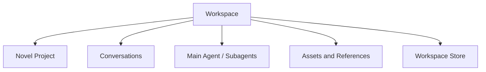
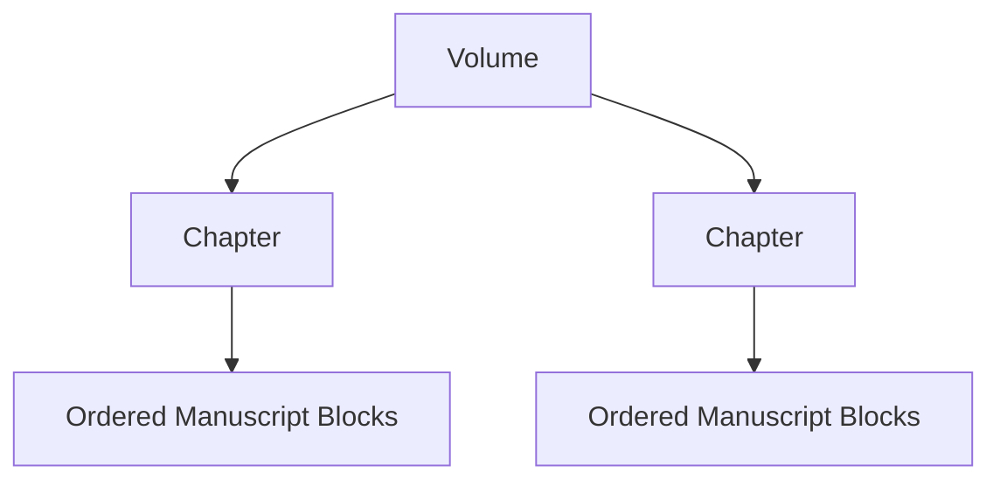
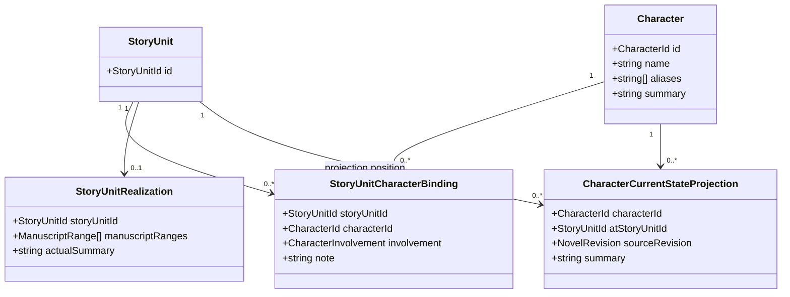

# Novel Domain Working Design

## 1. Document Status

This document records the current Novel-domain design discussion as of August 2, 2026.

- It is a working domain design, not an implementation claim.
- It does not add Novel-domain work to Runtime Task 1 through Task 7.
- Decisions marked **accepted direction** may be used in later Novel-domain planning.
- Decisions marked **current recommendation** still require review before implementation.

## 2. Workspace Boundary

**Accepted direction:** one Workspace corresponds to one Novel project.



- A Workspace owns one Novel project and may contain many Conversations.
- Main agents and subagents operate within the same Workspace access boundary unless explicitly granted read-only external references.
- The canonical Workspace identity remains independent from the physical work directory so an explicit rebind can preserve identity after a project move.
- A future series-level abstraction belongs above Workspace rather than allowing one Workspace to own multiple novels.

## 3. Separate Narrative, Manuscript, and Publication Structures

**Accepted direction:** story decomposition, written content, and publication organization are separate structures.


The Story Outline must not encode `Volume -> Chapter -> Scene` as its required hierarchy. Volume and Chapter are publication concepts, while the Story Outline is a narrative work-breakdown structure similar to a Todo tree.

## 4. Story Outline

### 4.1 Ordered StoryUnit Tree

**Accepted direction:** the outline is an ordered tree of stable `StoryUnit` nodes.

```ts
interface StoryUnit {
  readonly id: StoryUnitId;
  readonly outlineId: StoryOutlineId;
  readonly parentId?: StoryUnitId;
  readonly orderKey: OrderKey;

  readonly title: string;
  readonly intent?: string;
  readonly synopsis?: string;
}
```

- Core does not hard-code first-level, second-level, or third-level nodes.
- A node may be decomposed into smaller ordered child nodes at any time.
- A parent node expresses an aggregate narrative intention and summary rather than a traditional continuous scene.
- A leaf node is the smallest currently planned work unit, but it may later be decomposed without changing its stable identity.
- `StoryUnit` is preferred over calling every level `Scene`; higher-level nodes may represent an arc, sequence, investigation, relationship development, or another aggregate story unit.

An optional semantic scope may help presentation without determining hierarchy:

```ts
type StoryUnitScope =
  | "saga"
  | "arc"
  | "sequence"
  | "scene"
  | "custom";
```

The tree depth and `scope` are independent. User interfaces may show friendly level names without making those names persistence invariants.

### 4.2 Stable Ordering

**Accepted direction:** ordered siblings use stable IDs and opaque fractional ordering keys rather than array indexes or dense integers.

```ts
interface OrderKeyFactory {
  initial(): OrderKey;
  before(next: OrderKey): OrderKey;
  after(previous: OrderKey): OrderKey;
  between(previous: OrderKey, next: OrderKey): OrderKey;
}
```

- Moving a StoryUnit changes only its `parentId` and `orderKey`.
- Inserting a sibling does not renumber all later siblings.
- References always use stable IDs and never use outline paths or array indexes.
- Fractional indexing, LexoRank, or another variable-length lexical rank may implement `OrderKey` behind the stable contract.

## 5. StoryUnit Status and Reasons

**Current recommendation:** a Todo-like outline needs status, but planning maturity, manuscript realization, and temporary blocking are separate concerns.

### 5.1 Planning and Realization Status

```ts
type StoryUnitPlanningStatus =
  | "idea"
  | "outlined"
  | "ready";

type StoryUnitRealizationStatus =
  | "pending"
  | "in-progress"
  | "completed"
  | "abandoned";
```

```ts
interface StoryUnit {
  readonly planningStatus: StoryUnitPlanningStatus;
  readonly realizationStatus: StoryUnitRealizationStatus;
  readonly blockState?: StoryUnitBlockState;
  readonly abandonment?: StoryUnitAbandonment;
}
```

Semantics:

- `planningStatus` answers whether the narrative intention is sufficiently defined to write.
- `realizationStatus` answers whether that intention has been accepted as realized in manuscript content.
- `pending` means manuscript realization has not started.
- `in-progress` means some realization exists or active drafting and revision work has started, but the StoryUnit is not accepted as complete.
- `completed` means its narrative intention has been sufficiently expressed in manuscript content and accepted by the author or workflow.
- `abandoned` means the author no longer intends to realize this StoryUnit; it remains addressable for history, replacement tracking, and possible restoration.
- Producing text does not automatically mean `completed`, and `completed` does not mean published or permanently immutable.

### 5.2 Blocking Is Independent

`blocked` is a temporary execution condition rather than a manuscript-realization phase. Keeping it outside `realizationStatus` preserves whether the StoryUnit was pending or already in progress when it became blocked.

```ts
type StoryUnitBlockReason =
  | "dependency"
  | "decision-required"
  | "continuity-conflict"
  | "missing-material"
  | "outline-incomplete"
  | "other";

interface StoryUnitBlockState {
  readonly reasonCode?: StoryUnitBlockReason;
  readonly note?: string;
  readonly dependencyIds: readonly StoryUnitId[];
  readonly blockedAt: string;
}
```

- `reasonCode` supports filtering, automation, and Agent routing.
- `note` is an optional human-readable explanation of the current blocking condition.
- `dependencyIds` identifies StoryUnits whose progress or decisions may unblock this unit.
- Clearing the block removes the current `blockState`; the historical transition remains in Novel-domain Events.

### 5.3 Abandonment Information

An abandoned StoryUnit retains a structured reason and may point to the StoryUnit that replaced it.

```ts
type StoryUnitAbandonReason =
  | "story-direction-changed"
  | "replaced"
  | "merged"
  | "duplicate"
  | "scope-reduced"
  | "other";

interface StoryUnitAbandonment {
  readonly reasonCode?: StoryUnitAbandonReason;
  readonly note?: string;
  readonly replacementStoryUnitId?: StoryUnitId;
  readonly abandonedAt: string;
}
```

- `note` explains why the author abandoned the unit without overloading a generic status note.
- `replacementStoryUnitId` prevents replacement from being interpreted as simple deletion and helps Agents avoid proposing an obsolete direction again.
- `abandonment` is required while `realizationStatus` is `abandoned` and is cleared from current state if the unit is restored.

Recommended current-state invariants:

```text
realizationStatus = pending | in-progress
    blockState may be present

realizationStatus = completed
    blockState and abandonment are absent

realizationStatus = abandoned
    abandonment is present
    blockState is absent
```

### 5.4 Composite Progress

Leaf realization status may be stored directly. Composite progress should normally be exposed as a derived roll-up rather than maintained as a conflicting second source of truth.

```ts
interface StoryUnitProgressProjection {
  readonly storyUnitId: StoryUnitId;
  readonly effectiveStatus: StoryUnitRealizationStatus;
  readonly isBlocked: boolean;
  readonly completedLeafCount: number;
  readonly totalLeafCount: number;
}
```

Whether a composite StoryUnit may own an explicit block override, rather than only deriving blocked state from descendants, remains a command-model decision.

### 5.5 Status History

Current StoryUnit fields expose current state; Novel-domain Events preserve transition history:

```text
StoryUnitBlocked
StoryUnitUnblocked
StoryUnitAbandoned
StoryUnitRestored
```

Domain persistence may retain reason notes in these Events. Structured Runtime logs must only record safe identifiers and lifecycle metadata and must not emit the natural-language note content.

## 6. Beat Boundary

**Current recommendation:** Beat is optional and is not a required child type in the base StoryUnit tree.

A Beat is a lightweight ordered intention inside a sufficiently small StoryUnit, usually a scene-sized unit:

```ts
interface StoryBeat {
  readonly id: StoryBeatId;
  readonly storyUnitId: StoryUnitId;
  readonly orderKey: OrderKey;
  readonly intent: string;
  readonly expectedOutcome?: string;
}
```

Recommended rules:

- A StoryUnit does not require Beats.
- Beats help guide scene generation, revision, pacing, and coverage checks.
- Beats do not initially carry the full Todo lifecycle or independent manuscript ownership.
- A Beat that becomes large enough to require independent status, dependencies, assignment, or manuscript realization should be promoted into a child `StoryUnit`.
- Beat realization may later be represented as derived analysis rather than a manually maintained authoritative status.

This keeps the base outline simple for users while allowing more detailed planning when it is useful.

## 7. Manuscript Organization

**Accepted direction:** written content uses stable content Blocks organized by publication containers.

```ts
interface ParagraphBlock {
  readonly id: ManuscriptBlockId;
  readonly chapterId: ChapterId;
  readonly orderKey: OrderKey;
  readonly text: string;
}
```

- Paragraph is the initial persistent editing unit.
- Sentence is not a persistent domain entity; precise operations use offsets within a Block.
- Chapter is an ordered container of Manuscript Blocks rather than a fragile global array-index range.
- Volume is an ordered container of Chapters.
- StoryUnit does not become owned by Chapter merely because its realization appears in that Chapter.



## 8. Manuscript Anchors and Realization

StoryUnits associate with written content through stable Block anchors:

```ts
interface ManuscriptAnchor {
  readonly blockId: ManuscriptBlockId;
  readonly offset?: number;
  readonly bias: "left" | "right";
}

interface ManuscriptRange {
  readonly start: ManuscriptAnchor;
  readonly end: ManuscriptAnchor;
}

interface StoryUnitRealization {
  readonly storyUnitId: StoryUnitId;
  readonly ranges: readonly ManuscriptRange[];
}
```

- Ranges never use array indexes.
- Blocks inserted between existing anchors are naturally included according to current order.
- Anchor bias determines whether insertion at an exact boundary belongs inside or outside a range.
- One StoryUnit may realize across multiple ranges and Chapters.
- Node movement in the outline does not invalidate manuscript realization because the StoryUnit ID remains stable.

Deletion and structural edits require reference preservation:

- Deleted Blocks first become tombstones rather than disappearing while references still exist.
- Splitting a Block preserves one stable ID and records how anchors transform into the new Block.
- Merging Blocks retains a stable target and records a redirect from removed IDs.
- Moving a Block preserves its ID and changes only its container and ordering key.
- Invalid, inverted, disconnected, or orphaned ranges must be surfaced for repair rather than silently reinterpreted.

## 9. Publication Relationship

Chapter and Volume are publication structures whose actual authority is written content.

- A Chapter owns an ordered collection of Manuscript Blocks.
- A Chapter may also have optional planned StoryUnit coverage before content exists.
- Planned StoryUnit coverage answers what the chapter intends to contain; Manuscript Blocks answer what it actually contains.
- A Volume owns ordered Chapters, and its actual manuscript coverage is derived from them rather than duplicated as another authoritative range.
- A Volume may reference a primary higher-level StoryUnit for narrative intent, but that association is not its content boundary.

## 10. Initial Mutation Strategy

**Accepted direction:** initial Novel mutation uses serialized commands and revision checks rather than making the whole domain a CRDT.

```text
Novel Command Queue
    -> validate base revision
    -> apply one mutation
    -> maintain anchors and references
    -> persist
    -> publish Novel Event
```

- Fractional ordering keys handle frequent sibling and paragraph insertion.
- Stable IDs preserve references across movement.
- Tombstones and redirects preserve references across deletion, splitting, and merging.
- Optimistic revisions detect stale concurrent commands.
- A future collaborative editor may introduce CRDT behavior at the Paragraph text adapter boundary without changing the whole Novel domain contract.

## 11. Minimal Character Model

**Current recommendation:** the author primarily prepares the Story Outline. Character records remain minimal, while leaf StoryUnits describe participation, events, and character or location changes. Tools may derive and maintain reviewable state projections from those sources.

### 11.1 Minimal Contracts

```ts
interface Character {
  readonly id: CharacterId;
  readonly name: string;
  readonly aliases: readonly string[];
  readonly summary?: string;
}

interface StoryUnitCharacterBinding {
  readonly storyUnitId: StoryUnitId;
  readonly characterId: CharacterId;
  readonly involvement?: CharacterInvolvement;
  readonly note?: string;
}

interface StoryUnitRealization {
  readonly storyUnitId: StoryUnitId;
  readonly manuscriptRanges: readonly ManuscriptRange[];
  readonly actualSummary?: string;
}

interface CharacterCurrentStateProjection {
  readonly characterId: CharacterId;
  readonly atStoryUnitId: StoryUnitId;
  readonly sourceRevision: NovelRevision;
  readonly summary: string;
}
```



The binding and realization do not own one another. Both refer to the same stable StoryUnit for different purposes:

- `StoryUnitCharacterBinding` records planned character participation in the outline.
- `StoryUnitRealization` records where that StoryUnit was actually realized in manuscript content.
- `CharacterCurrentStateProjection` summarizes a character at a selected StoryUnit position by replaying relevant leaf StoryUnit changes.

Character stores only stable identity and information that should not be repeatedly inferred from the outline. Current location, injuries, relationships, life state, inventory, and similar changing information remain derived from StoryUnit participation and entity-change records rather than becoming mutable fields on Character.

### 11.2 NovelRevision

`NovelRevision` is the opaque logical version of the complete Novel project state.

```ts
type NovelRevision = string & {
  readonly __brand: "NovelRevision";
};
```

Its semantic rules are:

- The Repository creates a new NovelRevision after each accepted mutation to authoritative Novel-domain state.
- Outline, Character, Location, Manuscript, and Publication mutations may all advance the NovelRevision.
- Commands may carry a base NovelRevision for optimistic concurrency validation.
- A derived projection records the NovelRevision from which it was calculated.
- If the current NovelRevision differs from `sourceRevision`, the projection is potentially stale and must be validated or rebuilt before being treated as current.
- NovelRevision is not a Git commit, timestamp, Conversation Event ID, or Manuscript Block ordering key.
- Callers compare NovelRevision values for equality and do not parse or perform arithmetic on them.

Example:

```text
NovelRevision = revision-105
    -> calculate CharacterCurrentStateProjection
    -> projection.sourceRevision = revision-105

edit a relevant leaf StoryUnit
    -> NovelRevision = revision-106
    -> projection from revision-105 is potentially stale
```

The initial global NovelRevision deliberately provides coarse invalidation. It may mark a Character projection potentially stale after an unrelated Novel mutation, but it keeps the first contract simple and safe. If measured rebuild cost becomes significant, a later projection may additionally record narrower Outline, Manuscript, or dependency revisions without removing the global NovelRevision.

### 11.3 Projection and Review Boundary

`CharacterCurrentStateProjection` is a repairable Tool-maintained table rather than another authoritative character fact store.

```text
Character stable profile
    + relevant accepted leaf StoryUnit bindings
    + ordered character and location change notes
    = CharacterCurrentStateProjection
```

Recommended query behavior:

- A state query always names the target `atStoryUnitId`; there is no context-free global current state.
- Tool results return the source StoryUnit IDs used as evidence even if the cached projection stores only their summarized result initially.
- Agent-proposed corrections enter a reviewable state before replacing accepted projections or authoritative StoryUnit changes.
- Human rejection leaves authoritative outline and manuscript data unchanged.
- Outline reordering, insertion, removal, abandonment, or change-note edits invalidate affected projections from the earliest changed narrative position.
- A missing projection is rebuilt from Character baseline information and relevant StoryUnits rather than treated as lost Novel truth.

Full pairwise Character relationship storage remains excluded from the initial model. Relationship changes that materially affect the story are recorded sparsely as leaf StoryUnit entity changes, while protagonist-centered or arbitrary-focus relationship views are generated on demand by Tools.

## 12. Current Open Questions

The following decisions remain outside the accepted Runtime implementation plan:

1. The exact `OrderKey` algorithm and rebalance policy.
2. Whether composite StoryUnits may explicitly override derived blocking and how descendant abandonment affects aggregate completion.
3. Whether planned Chapter coverage uses a contiguous leaf range, an explicit ordered selection, or both.
4. The exact command and event contracts for Block split, merge, move, and anchor repair.
5. The storage layout for Manuscript Blocks and Novel-domain Journal records.
6. The promotion workflow from `StoryBeat` to child `StoryUnit`.
7. Whether Beat realization is stored, derived, or omitted in the first implementation.
8. The concrete NovelRevision generation format and whether narrower component revisions are needed after measuring projection rebuild cost.
9. The exact review-state contract for Tool-proposed Character and Location projections.
