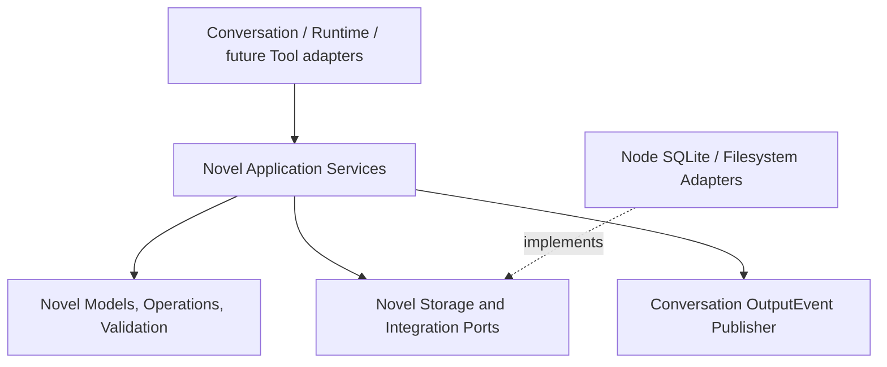

# Novel Layer Implementation Plan

## 1. Document Status

This document is the authoritative implementation plan for the Novel layer as of August 2, 2026.

- Novel Task N0 through Task N6 is completed and remains the accepted Novel foundation.
- Novel Task N7 through Task N11 is paused while Runtime Task 5A-B through Task 7 is the active repository track in `docs/implementation-plan.md`.
- Novel implementation must preserve the accepted domain and architecture boundaries in `docs/novel-domain.md`.
- Agent-facing Novel Tools, Tool YAML, Prompt composition, Agent definitions, and CLI/GUI/Web Novel interfaces are outside this plan.
- Each completed Novel step must be validated and committed independently before the next step begins.

## 2. Autonomous Execution Agreement

The repository protocol in `AGENTS.md` remains authoritative. Novel autonomous execution resumes from Task N7 only after an explicit track change; the current active execution cycle is defined by `docs/implementation-plan.md`.

The mandatory cycle is:

```text
Read AGENTS.md and the active Novel task
    ↓
Read docs/novel-domain.md and relevant existing code
    ↓
Publish one concrete step plan
    ↓
Implement only that step
    ↓
Run focused validation
    ↓
Run pnpm check and all established Core smoke scripts
    ↓
Review scope, generated files, secrets, and formatting
    ↓
Commit the step immediately
    ↓
Publish the next step plan and continue
```

Autonomous authority does not permit the agent to:

- implement Agent-facing Novel Tools or Tool YAML
- reopen unrelated Runtime checkpoints
- silently choose a decision explicitly marked unresolved when implementation cannot proceed safely without it
- combine multiple Novel task boundaries into one commit
- expose SQLite, Node, Pi, process placement, filesystem paths, or future Rust details through platform-neutral Novel contracts

## 3. Accepted Technical Boundary



The implementation follows these rules:

- one Workspace corresponds to one Novel
- `runtime.sqlite` and `novel.sqlite` remain separate
- each top-level Conversation may own one active Draft Session
- multiple Conversations may own independent Drafts concurrently
- each Draft owns one durable `draft.sqlite`
- each Draft has one serialized Draft Writer
- each Novel has one serialized canonical Commit Writer
- Draft operations use short SQLite transactions
- canonical Commit uses one short SQLite transaction
- Draft state never replaces the canonical SQLite file directly
- Domain Operations are the deterministic Commit and Rebase contract
- the canonical database is the authority for accepted Novel state, Commit existence, and NovelRevision
- external Commit payload files are auxiliary immutable history, not Commit authority
- all public Novel application and port methods are asynchronous
- a Node adapter may use synchronous SQLite internally behind a serialized asynchronous boundary

## 4. Deferred-Type Resolution

The following contracts are not invented during foundation tasks:

```text
StoryTimeDescription
ManuscriptAnchor
ManuscriptRange
StoryUnitBlockState
StoryUnitAbandonment
OrderKey
```

Their implementation gates are:

- `OrderKey`, `StoryUnitBlockState`, `StoryUnitAbandonment`, and
  `StoryTimeDescription` were resolved for V1 in `docs/novel-domain.md` before
  Task N9 implementation began
- `ManuscriptAnchor` and `ManuscriptRange` must be resolved before the affected Task N10 manuscript steps.
- Earlier tasks must not add placeholder public contracts that silently predetermine these decisions.

## 5. Task Graph

```mermaid
flowchart LR
    N0["N0<br/>Activate Track"]
    N1["N1<br/>Foundation"]
    N2["N2<br/>Canonical Store"]
    N3["N3<br/>Draft Sessions"]
    N4["N4<br/>Operation Engine"]
    N5["N5<br/>Character / Location"]
    N6["N6<br/>Canonical Commit"]
    N7["N7<br/>Rebase / Conflict"]
    N8["N8<br/>Conversation / Events"]
    N9["N9<br/>Outline"]
    N10["N10<br/>Manuscript / Publication"]
    N11["N11<br/>Projection / Recovery"]

    N0 --> N1 --> N2 --> N3 --> N4 --> N5 --> N6 --> N7 --> N8 --> N9 --> N10 --> N11
```



## 6. Task N0: Activate the Novel Track

### N0-A Implementation Plan

Create this implementation plan and update repository execution documents so Novel work is no longer described as deferred.

### N0-B Deliverables

- `docs/novel-implementation-plan.md`
- `AGENTS.md` active-track and recovery instructions
- `docs/implementation-plan.md` reference to the separate Novel track
- `docs/architecture.md` removal of the stale claim that the Novel domain is intentionally deferred

### N0-C Exit Criteria

- Novel N0 through N11 is the documented current active track.
- Runtime Task 1 through Task 7 is paused rather than deleted.
- Tool implementation remains excluded.
- Recovery reading includes this plan while the Novel track is active.

**Status:** completed by the commit that introduces this plan.

## 7. Task N1: Novel Foundation Protocols

### N1-A Module Skeleton

Create platform-neutral and Node adapter roots:

```text
core/src/novel/
core/src/node/novel/
```

Add explicit index exports without adding Tool code.

### N1-B Stable Identities

Define opaque public identities required by infrastructure:

```text
NovelId
NovelDraftSessionId
NovelOperationId
NovelCommitId
NovelConflictId
NovelArtifactId
```

### N1-C Version Contracts

Define and validate distinct contracts:

```text
NovelRevision
NovelSchemaVersion
NovelEntityVersion
```

`NovelRevision` remains opaque and equality-only. `NovelSchemaVersion` is migration state. `NovelEntityVersion` supports entity replacement and conflict preconditions.

### N1-D Foundation Ports and Failures

Define Clock and ID factories plus payload-free public validation and lifecycle errors. Important files receive concise top-level purpose comments. Important execution boundaries use structured redacted logs without Novel payloads, text, paths, raw errors, stacks, or causes.

### N1-E Validation

Add focused foundation smoke coverage, then run the complete repository suite.

### N1-F Delivered

- platform-neutral `core/src/novel` and Node adapter `core/src/node/novel` public roots
- branded non-interchangeable Novel, Draft Session, Operation, Commit, Conflict, and Artifact identities
- safe ASCII identity capture that rejects blank, whitespace, path-shaped, control-shaped, and oversized identities without exposing rejected values
- distinct opaque NovelRevision, positive safe-integer NovelSchemaVersion and NovelEntityVersion, and canonical UTC NovelTimestamp contracts
- injectable Novel Clock and collision-resistant random Novel identity factory
- fixed payload-free protocol, Draft lifecycle, revision-conflict, and invariant failures
- focused compile-time brand isolation and runtime foundation smoke coverage

**Status:** completed by the focused Novel foundation commit.

## 8. Task N2: Canonical Novel Store

### N2-A Store Location

Define a Novel Store location derived from the accepted Workspace Store:

```text
storeDir/
├── runtime.sqlite
├── novel.sqlite
├── novel-staging/
├── novel-history/commits/
└── novel-artifacts/
```

Physical paths remain Node-only.

### N2-B Canonical Bootstrap

Create initial canonical schema and migrations for:

```text
novel_metadata
novel_commits
novel_outbox
novel_draft_sessions
novel_schema_migrations
```

### N2-C Identity and Migration Validation

Verify exact Workspace and Novel identity, monotonic schema migration, and fixed safe failures when a database belongs to another Workspace or is structurally invalid.

### N2-D Validation

Add canonical bootstrap, identity, migration, reopening, and redacted logging smoke coverage.

### N2-E Delivered

- Node-only Novel Store location derived from the accepted Workspace Store, with `novel.sqlite`, `novel-staging/`, `novel-history/commits/`, and `novel-artifacts/`
- compatibility with the existing Runtime Workspace database path, which remains `workspace.databasePath` and currently resolves to `novel.db`; Novel N2 does not rename or migrate Runtime storage
- canonical SQLite control schema for metadata, Draft lifecycle records, Commit metadata, transactional Outbox records, and ordered schema migrations
- immutable canonical metadata with exact Workspace binding, optional expected Novel identity validation, opaque current revision, and schema version
- strict contiguous migration-history validation and fixed safe failures for foreign Workspace, foreign Novel, unsupported schema, malformed structure, and closed Store access
- idempotent close behavior and structured lifecycle logs containing identifiers and safe status metadata only
- focused smoke coverage for path layout, canonical bootstrap, reopen stability, identity mismatch, future or altered migration history, malformed databases, driver-open failure, and log redaction

**Status:** completed by the focused canonical Novel Store commit.

## 9. Task N3: Durable Draft Sessions

### N3-A Draft Protocol

Implement Draft identity, status, base revision, owner Conversation, and lifecycle services without Commit or Rebase behavior.

### N3-B Consistent Snapshot

Use the Node `node:sqlite` backup API behind `NovelSnapshotter` to create `draft.sqlite` from the exact canonical base revision. Ordinary filesystem copy is not an accepted snapshot implementation.

### N3-C Lifecycle

Implement:

```text
startDraft
getActiveDraft
resetToMain
rollback
recoverDraftSessions
```

`startDraft` never overwrites an existing active Draft. `rollback` terminates the Draft. `resetToMain` preserves the session identity while replacing its working state from the latest canonical revision.

### N3-D Validation

Cover multiple Conversation Drafts, same-Conversation exclusivity, restart recovery, reset, rollback, snapshot failure cleanup, and path redaction.

### N3-E Delivered

- immutable Draft Session protocol covering identity, owning Conversation, base NovelRevision, lifecycle status, and timestamps
- platform-neutral canonical Draft Store and Novel Snapshotter ports with no physical path exposure
- canonical SQLite Draft records enforcing one non-terminal Draft per top-level Conversation
- durable per-Conversation staging layout containing `manifest.json`, `draft.sqlite`, and an Artifact directory
- WAL-aware `node:sqlite.backup()` snapshots with source and destination revision validation; ordinary filesystem copying is not used
- lifecycle services for `startDraft`, `getActiveDraft`, `resetToMain`, and `rollback`, with same-Conversation serialization and cleanup compensation
- restart recovery that reopens valid Drafts, reconciles completed reset snapshots, rolls back missing or invalid working copies, removes terminal working state, and deletes orphan snapshots
- focused coverage for concurrent Conversation Drafts, exclusivity, reopen recovery, latest-revision reset, rollback, orphan and missing snapshots, failed snapshot cleanup, and path/content redaction

**Status:** completed by the focused durable Draft Session commit.

## 10. Task N4: Domain Operation Engine

### N4-A Operation Protocol

Define immutable versioned Domain Operations and preconditions. Operations contain no closures, raw SQL, Provider requests, or deferred content generation.

### N4-B Registry and Executor

Implement a typed Operation Registry and executor behind platform-neutral repository ports.

### N4-C Draft Operation Journal

Create Draft control tables for ordered Operations, digests, metadata, conflicts, projections, and outbox state as required by the implemented step.

### N4-D Serialized Draft Writer

One short Draft SQLite transaction validates an Operation, records it, applies it through a handler, updates Draft metadata, and records the outbox item. Queue failure cannot poison later writes.

### N4-E Validation

Cover protocol immutability, JSON-only payload admission, branded Operation versions, precondition validation, duplicate registration, missing handlers, and synchronous Handler enforcement.

### N4-F Delivered

- immutable versioned Domain Operation envelopes with branded Operation IDs and Operation versions
- discriminated entity-exists, entity-absent, entity-version, and field-digest preconditions
- canonical JSON capture that rejects closures, `undefined`, non-finite numbers, cycles, and non-plain objects
- typed Operation Registry keyed by Operation type and version
- asynchronous public Executor boundary whose transaction-facing Handler must complete synchronously
- fixed payload-free failures for invalid Operations, duplicate registration, missing handlers, and asynchronous Handler implementations
- focused compile-time brand separation and runtime protocol/registry smoke coverage
- accepted canonical Operation digest over the complete envelope using shared canonical JSON, UTF-8, SHA-256, and `sha256:<64 lowercase hexadecimal characters>`
- versioned Draft-local metadata, ordered Operation Journal, conflict, projection, and durable Outbox control tables initialized on every new or reset snapshot
- atomic duplicate detection, Operation Journal append, synchronous Handler application, metadata advancement, and Outbox insertion in one short SQLite transaction
- same Operation ID and Digest idempotency, with conflicting durable content rejected by a fixed identity-conflict failure
- per-Draft asynchronous Writer queues that preserve FIFO order, permit independent Drafts, and remain usable after a rejected write
- restart-safe sequence continuation and focused coverage for canonical Digest validation, duplicate identity, ordering, transaction rollback, post-failure recovery, restart recovery, and redacted logs using private test Operations

**Status:** completed by the focused Domain Operation Engine commit.

## 11. Task N5: Character and Location Vertical Slice

Character and Location are the first concrete domain slice because their accepted contracts do not depend on the deferred types in Section 4.

### N5-A Models and Schema

Implement accepted Character and Location identities, stable profile fields, entity versions, canonical tables, and Draft tables through shared schema migration semantics.

### N5-B Operations

Implement deterministic create, full-replace, and safe-delete Operations with preconditions. Dynamic story state remains excluded from stable profiles.

### N5-C Services and Queries

Implement Character and Location application and query services against explicit canonical or Draft read scopes. No Tool adapters are added.

### N5-D Validation

Cover Draft create/replace/delete, canonical isolation, entity-version conflicts, restart recovery, invalid profile fields, and content-safe logs.

### N5-E Delivered

- branded Character and Location identities plus strict progressively completed stable-profile models
- shared canonical and Draft SQLite schema for versioned Character and Location records
- deterministic create, full-replace, and safe-delete Operations with exact payload and precondition validation
- atomic Draft execution through the shared Operation Registry, Mutation Service, per-Draft Writer, Journal, entity tables, and Outbox
- platform-neutral Character, Location, and explicit-scope query services with a Node SQLite composition factory
- canonical isolation, entity-version rollback, restart recovery, dynamic-field rejection, malformed Operation rejection, and content-safe log coverage

**Status:** completed by the focused Character and Location vertical-slice commit.

## 12. Task N6: Canonical Commit

### N6-A ChangeSet

Freeze the effective Draft Operation sequence, validate its canonical form, calculate its digest, and stop later mutation from joining that ChangeSet.

The accepted ChangeSet digest identity is separate from the deferred Commit history payload encoding:

```text
canonicalStringifyJson({
  changeSetVersion,
  novelId,
  baseRevision,
  operationCount,
  lastOperationSequence,
  operations: [{ sequence, operationDigest }]
})
    -> UTF-8
    -> SHA-256
    -> sha256:<64 lowercase hexadecimal characters>
```

- Draft Session ID and freeze timestamp identify the durable frozen record but do not participate in content identity.
- Operation envelopes are protected by their previously accepted complete-envelope digests.
- Array order and explicit sequence values both participate in the ChangeSet digest.
- Freezing uses the same per-Draft Writer queue plus a durable SQLite compare-and-set, so a concurrent write is either included before the freeze or rejected afterward.
- This contract does not choose the N6-C history filename, JSON/JSONL payload encoding, preparation, cleanup, or recovery protocol.

**Status:** completed by the focused frozen ChangeSet commit.

### N6-B Commit Writer

Serialize canonical Commit for one Novel, validate base revision, replay the complete ChangeSet, validate final invariants, insert Commit metadata, increment NovelRevision exactly once, and insert the canonical outbox record in one short SQLite transaction.

Delivered boundaries:

- one asynchronous per-Novel Commit Writer serializes history reconciliation, payload preparation, verification, and canonical SQLite execution
- the canonical transaction detects exact duplicate Commit identity before revision checks, rejects conflicting identity, and rejects stale base revisions without partial replay
- the complete frozen ChangeSet is replayed through the registered synchronous Operation Handlers, followed by the injected final invariant validator
- Commit metadata, NovelRevision, Draft terminal state, and canonical Outbox insertion succeed or roll back together
- caller-supplied Commit ID, result revision, and committed timestamp support exact idempotent retry

**Status:** completed by the focused canonical Commit Writer commit.

### N6-C History Payload

The immutable Commit history payload protocol is accepted as follows:

```text
novel-history/commits/<commitId>.json
```

- `payload_ref` stores only the safe basename `<commitId>.json`; absolute paths never enter platform-neutral contracts or canonical metadata.
- The payload is canonical JSON encoded as UTF-8 with no byte-order mark and no trailing newline.
- The exact version-1 envelope is:

```ts
interface NovelCommitPayloadV1 {
  readonly payloadVersion: 1;
  readonly commitId: NovelCommitId;
  readonly novelId: NovelId;
  readonly draftSessionId: NovelDraftSessionId;
  readonly ownerConversationId: string;
  readonly baseRevision: NovelRevision;
  readonly resultRevision: NovelRevision;
  readonly changeSetDigest: NovelChangeSetDigest;
  readonly operationCount: number;
  readonly committedAt: NovelTimestamp;
  readonly operations: readonly {
    readonly sequence: number;
    readonly operationDigest: NovelOperationDigest;
    readonly operation: NovelOperation;
  }[];
}
```

- `payload_digest` is SHA-256 over the exact payload bytes and uses `sha256:<64 lowercase hexadecimal characters>`.
- `payload_size` is the exact UTF-8 byte length and must be a non-negative safe integer.
- Commit ID, result revision, committed timestamp, complete payload bytes, digest, and size are fixed before the canonical SQLite transaction starts.
- Preparation writes `.<commitId>.<nonce>.tmp` in the Commit directory using exclusive creation, flushes and fsyncs the file, atomically renames it to `<commitId>.json`, then fsyncs the directory.
- If the final file already exists, preparation verifies canonical bytes, digest, and size. An exact match is idempotently reused; any mismatch is a fixed Commit payload identity conflict.
- Immediately before inserting canonical Commit metadata, the Commit Writer reopens and verifies the prepared regular file, safe filename, exact size, and digest. SQLite never records an unverified payload reference.
- A failed or stale canonical transaction leaves the prepared final file as an orphan. Startup recovery and pre-Commit reconciliation run under the per-Novel Commit Writer, delete recognized temporary files, and remove recognized final payload files that are not referenced by `novel_commits`.
- Canonical Commit metadata remains authoritative if a referenced payload file later disappears. Recovery regenerates the exact payload only when the preserved frozen Draft still matches the stored ChangeSet digest; otherwise it reports a fixed history-integrity failure without deleting or rolling back the canonical Commit and without fabricating Operations.
- Retention duration for committed Drafts and broad Artifact quotas remain deferred; they may improve recoverability but do not change this protocol.

**Status:** protocol accepted; implementation proceeds in N6-B through N6-D.

### N6-D Validation

Cover success, complete rollback, stale revision, duplicate Commit identity, digest mismatch, outbox persistence, interrupted payload preparation, and restart recovery.

Delivered validation and recovery:

- final invariant failure after replay rolls back entity changes, Commit metadata, NovelRevision, Draft terminal state, and Outbox together
- exact Commit identity retries return the existing Commit without replay or revision advancement
- stale concurrent Drafts preserve canonical state and leave only a recoverable orphan payload
- history reconciliation removes recognized interrupted temporary files and unreferenced final payloads while preserving unknown files
- missing referenced payloads are regenerated byte-for-byte after restart from a preserved frozen Draft whose Operation and ChangeSet digests match canonical metadata
- missing payloads without a trustworthy frozen Draft fail with a fixed history-integrity error while the canonical Commit remains authoritative
- payload corruption, Journal corruption, digest mismatch, Outbox content safety, and restart behavior have focused smoke coverage

**Status:** Task N6 completed by the ChangeSet, payload protocol, history adapter, canonical Commit Writer, and recovery commits.

## 13. Task N7: Rebase and Conflict

### N7-A Rebase Candidate

Preserve the stale source Draft, snapshot the latest canonical revision into a sibling candidate, and replay source Operations with their original preconditions.

Delivered boundaries:

- canonical-to-Draft snapshots use the SQLite Backup API and are assembled in
  recognized same-parent temporary directories before atomic publication
- snapshot validation binds Novel, Draft, owner, exact base revision, Draft
  metadata, and SQLite integrity without copying WAL sidecar files
- a prepared Rebase Candidate has its own Draft identity and canonical registry
  record while the source Draft record, snapshot, status, and Operation Journal
  remain unchanged
- source Operations and their digests are verified, replayed in original order,
  and applied with their original preconditions against the latest canonical
  projection
- precondition failure never forces an overwrite and removes the incomplete
  candidate until N7-B can persist a conflict protocol
- startup Draft recovery preserves registered candidates, removes unregistered
  recognized candidates when the candidate registry is available, and cleans
  recognized interrupted snapshot directories while preserving unknown files

**Status:** completed by the focused Rebase Candidate commit.

### N7-B Conflict Protocol

Implement the accepted conflict kinds and safe digest-based conflict snapshots without logging Novel content.

Delivered boundaries:

- immutable version-1 Conflict records contain only safe identities, source
  sequence, accepted Conflict kind, optional field path, timestamps, and
  SHA-256 evidence digests
- base evidence hashes the original Operation precondition; canonical and
  Draft evidence hash transient canonical entity snapshots whose content is
  never persisted in Conflict rows or logs
- candidate-local Conflict persistence verifies canonical JSON and digest
  identity, supports exact duplicate retry, and rejects mismatched durable
  identity as a fixed invariant failure
- Rebase converts Character and Location precondition failures into
  `entity-created`, `entity-deleted`, `field-modified`, or `domain-invariant`
  records, skips the rejected Operation, and continues ordered replay
- conflicted candidates remain durably registered and recoverable together
  with their untouched source Draft; N7-C owns resolution and promotion

**Status:** completed by the focused digest-only Conflict Protocol commit.

### N7-C Resolution

Implement `keep-canonical`, validated `keep-draft`, `drop-operation`, and manual replacement Operation strategies.

Resolution protocol foundation delivered:

- immutable version-1 records capture all four strategies and require a fully
  captured replacement Operation only for `manual`
- canonical decision JSON and SHA-256 provide exact retry identity
- candidate-local SQLite transitions one Conflict from `unresolved` to
  `resolved` atomically and rejects a different second decision
- restart reads validate stored decision JSON and digest before returning it
- immutable version-1 Resolution Application Plans preserve one entry for every
  source Operation sequence before any strategy mutates a projection
- complete Resolution mapping rejects missing, extra, duplicate-sequence, wrong
  candidate, corrupted source Journal, digest, and effective Operation identity
  inputs
- `keep-canonical`, `drop-operation`, `manual`, and injected `keep-draft`
  planning compile to ordered skip, original, or replacement entries
- candidate-local SQLite persists plan metadata and entries atomically, returns
  exact retries as duplicates, rejects a second identity, and reconstructs and
  revalidates the plan after restart
- Character and Location keep-draft rebinding deterministically maps
  create/replace/delete intent plus sequence-local entity state to a replacement
  Operation or explicit no-op, rejecting unsupported identity and Conflict-kind
  combinations
- an existing immutable plan is validated against current source Operations and
  durable decisions without invoking keep-draft planning again, preserving exact
  retry when replacement identities and timestamps were originally generated
- resolved sibling candidate identities have a separate canonical registry that
  links source Draft, conflicted candidate, Resolution Plan digest, rebuilt Draft
  identity, base revision, effective Operation count, and preparation timestamp
  without replacing either preserved predecessor
- resolved rebuilding requires canonical revision to remain equal to the
  conflicted candidate base, creates a fresh sibling snapshot, replays only
  effective plan entries in source order, verifies the rebuilt Journal, and
  registers the sibling only after replay succeeds
- replay failure removes the unregistered sibling snapshot while preserving the
  source Draft, conflicted candidate, durable decisions, and application plan

**Status:** protocol, durable decision recording, and immutable strategy
application planning plus concrete Character/Location rebinding completed;
resolved sibling candidate registry and atomic sequential rebuilding completed;
Approval invalidation is the next N7 step.

### N7-D Approval Invalidation

Any Rebase or conflict resolution that changes base revision or effective ChangeSet digest invalidates previous Approval.

Delivered boundaries:

- immutable version-1 Approval grants bind Draft identity, base revision,
  ChangeSet digest, ordered Operation IDs, timestamp, canonical JSON, and SHA-256
- Draft SQLite schema v6 retains active and invalidated Approval audit records,
  supports exact duplicate grant retry, and supersedes an older active identity
- explicit invalidation records fixed safe reasons without Novel content
- optional Node application enforcement verifies Approval inside Commit Writer's
  per-Novel serialized section before history preparation or canonical mutation
- Rebase invalidates the source Draft Approval with `base-revision-changed`
  before candidate registry publication; new candidate identities never inherit
  predecessor Approval

**Status:** completed by the focused Novel ChangeSet Approval commit.

### N7-E Validation

Use concurrent Character and Location Drafts to cover non-overlapping automatic Rebase, same-field conflict, delete/update conflict, idempotent create, manual resolution, crash recovery, and successful post-resolution Commit.

Resolved-candidate promotion foundation delivered:

- promotion atomically moves the preserved source Draft to `conflicted` and
  registers the rebuilt sibling as the owner's `active` writable Draft
- `conflicted` Drafts remain durable and inspectable but no longer consume the
  one-active-writable-Draft owner slot
- the canonical resolved-candidate registry records `promoted_at`; exact retry
  after restart reconstructs the same immutable promotion result
- promotion never inherits the predecessor Approval; the promoted Draft must
  freeze its own ChangeSet and obtain a new Approval before enforced Commit

The existing Character/Location Rebase smoke now also proves that a promoted
resolved sibling cannot Commit under enforced Approval before obtaining a new
grant, then freezes its own ChangeSet, records that grant, commits the ordered
effective Operations, advances canonical revision, reaches `committed`, and is
read back with the same revision after reopening canonical storage.

**Status:** Task N7 completed by Rebase Candidate, digest-only Conflict,
Resolution Plan and rebuilding, Approval invalidation, atomic promotion, and
successful approved post-resolution Commit validation.

## 14. Task N8: Conversation and OutputEvent Integration

### N8-A Binding

Implement the Conversation-to-Novel and active-Draft binding boundary without making Conversation the Novel aggregate.

Delivered boundaries:

- immutable bindings contain only Conversation ID, Novel ID, optional active
  Draft Session ID, and safe timestamps
- a provider-neutral application service binds Novel context, attaches an
  owner-matching writable Draft, clears it with compare-and-set semantics, and
  reads the durable binding without referencing a Conversation object
- canonical SQLite schema v6 persists one binding per Conversation and prevents
  one Draft Session from being attached to multiple bindings
- root/subagent Conversation identity selection remains an upper-layer concern;
  shared Subagents may deliberately use the root binding without changing Novel
  ownership

**Status:** completed by the Conversation Novel Binding protocol, SQLite
adapter, and restart/owner validation smoke.

### N8-B Lifecycle Events

Define internal Novel lifecycle records and public Novel OutputEvents for Draft, Commit, Rebase, conflict, and recovery transitions. Payloads expose stable safe identities and metadata rather than Novel content.

Internal lifecycle protocol foundation delivered:

- immutable version-1 records cover Draft, Commit, Rebase, Conflict, and
  Recovery transitions through a closed discriminated event-type union
- every record binds a stable event ID, Novel ID, Conversation ID, timestamp,
  and event-specific safe identities, revisions, statuses, strategies, or counts
- payload capture rejects additional fields so Novel text, prompts, paths, Tool
  data, and raw errors cannot silently enter durable lifecycle records
- canonical JSON is deterministic and independent from public OutputEvent
  construction or delivery

Public event bridge delivered:

- `NovelLifecycleOutputEvent` preserves the durable Record's event ID,
  Conversation ID, timestamp, and `novel.<lifecycle-type>` identity
- public payloads expose lifecycle version, Novel ID, and only the already
  validated event-specific safe metadata
- all thirteen lifecycle event types are registered in the Core OutputEvent
  Schema Registry with `additionalProperties: false`
- snapshot validation rejects accidental Novel text or other undeclared data

**Status:** internal lifecycle records and public Novel OutputEvents completed;
atomic Draft/canonical Outbox write integration is the next N8-B step.

Atomic Outbox encoding delivered:

- the existing Draft Operation transaction now writes a complete
  `draft.operation.applied` lifecycle Record rather than an adapter-local event
- canonical Commit writes the complete `commit.completed` lifecycle Record in
  the same transaction as entity replay, revision advancement, Commit metadata,
  Draft terminal state, and canonical Outbox insertion
- a shared Node encoder validates canonical JSON and computes SHA-256 over the
  exact durable Record bytes; no Novel content enters either Outbox

**Status:** internal/public lifecycle protocols and Draft/Commit atomic Outbox
encoding completed; remaining lifecycle service write points follow before N8-C.

General Draft Outbox storage delivered:

- Draft SQLite schema v7 adds Novel ID, Conversation ID, schema version, and a
  stable created-time ordering key to every durable Outbox row
- Operation sequence and Operation ID remain paired and unique when present but
  are nullable for Draft, Rebase, Conflict, Approval, and Recovery lifecycle
  events that are not caused by one Operation Journal entry
- migration copies existing Operation Outbox rows without changing Event IDs,
  JSON bytes, digests, publication state, or attempt counts

**Status:** general Draft lifecycle Outbox foundation completed; service-level
lifecycle writers are the next N8-B step.

Canonical Draft lifecycle writes delivered:

- Draft Session creation and its `draft.started` Outbox Record commit in one
  canonical SQLite transaction
- Draft rollback and its `draft.rolled.back` Outbox Record commit in one
  canonical SQLite transaction using the pre-transition base revision
- deterministic Event IDs make the durable facts retry-identifiable, while a
  failed transaction leaves neither a Session transition nor an orphan event

**Status:** Draft create/rollback lifecycle writers completed; Rebase, Conflict,
promotion, and Recovery lifecycle writers remain before N8-C.

Canonical Rebase lifecycle writes delivered:

- candidate registry insertion and `rebase.prepared` are atomic
- resolved sibling registry insertion and `rebase.resolved` are atomic
- source transition, promoted Draft insertion, promotion timestamp, and
  `rebase.promoted` share the promotion transaction
- registry failure rolls back its lifecycle Record; exact promotion retry does
  not create a second Event identity

**Status:** canonical Rebase lifecycle writers completed; candidate-local
Conflict and Resolution lifecycle writers are the next N8-B step.

Candidate-local Conflict lifecycle writes delivered:

- durable Conflict insertion and `conflict.detected` share one candidate Draft
  transaction
- immutable Resolution update and `conflict.resolved` share one candidate Draft
  transaction
- one Operation may produce multiple Conflict events because these lifecycle
  rows intentionally leave the optional Operation Outbox columns null
- exact Conflict or Resolution retry returns `duplicate` without inserting a
  second lifecycle Event

**Status:** Conflict/Resolution lifecycle writers completed; Recovery summary
and remaining state-transition lifecycle coverage are next before N8-C.

Commit Recovery lifecycle delivered:

- a provider-neutral `NovelLifecycleRecordWriter` persists already validated
  Records without exposing SQLite to the recovery service
- the Node canonical writer validates exact duplicate Event identity and rejects
  an Event ID reused with different metadata
- successful missing-payload regeneration records retry-stable
  `commit.recovered` using Commit ID and original committed timestamp

**Status:** Commit Recovery lifecycle completed; Draft Recovery lifecycle is the
final N8-B writer step before N8-C.

Draft Recovery lifecycle delivered:

- every canonical Draft whose snapshot is successfully verified records one
  owner-routed `recovery.completed` Event with `scope=draft`
- Event identity and timestamp derive from immutable Draft identity/creation
  metadata, so repeated startup verification is an exact duplicate
- recovery-triggered rollback remains covered by the Draft Store's atomic
  `draft.rolled.back` Event
- unregistered orphan cleanup does not fabricate a Conversation route and is
  therefore retained in internal recovery results/log metadata only

**Status:** Task N8-B lifecycle records, public events, atomic writers, and
Recovery coverage completed. Task N8-C Outbox Dispatcher is next.

### N8-C Outbox Dispatcher

Dispatch canonical and Draft outbox records idempotently through the accepted Conversation Output publisher and Runtime Journal boundary.

Outbox protocol foundation delivered:

- one provider-neutral Entry protocol represents canonical and Draft lifecycle
  records through an explicit source discriminator
- Entries expose only a validated lifecycle Record, its SHA-256 digest, and safe
  delivery metadata; raw SQLite rows remain adapter-private
- stable pagination uses lifecycle occurrence time plus Event ID, while a source
  key provides deterministic merge ordering across stores
- the Store port separates pending-page reads, delivery-attempt recording, and
  compare-and-set publication marking for restart-safe dispatch

**Status:** N8-C Outbox protocol and Store port completed; SQLite pending-page
reading with lifecycle JSON/digest validation is next.

SQLite pending-page reading delivered:

- one Node reader opens either canonical or Draft Outbox storage through an
  explicit validated source identity
- pending rows are ordered by lifecycle occurrence time and Event ID and support
  stable cursor pagination without exposing SQLite rows above the adapter
- every row must contain canonical lifecycle JSON whose Event identity, Novel,
  Conversation, type, schema version, timestamp, and stored SHA-256 all agree
- published rows are excluded, existing attempt counts are preserved, and
  corrupt records fail with content-safe integrity categories

**Status:** N8-C SQLite pending-page reading and integrity validation completed;
attempt recording and compare-and-set publication marking are next.

SQLite delivery-state writes delivered:

- one writable Store composes the verified Reader for canonical and Draft
  sources without duplicating row decoding
- attempt recording atomically increments only an unpublished row whose Event,
  Novel, source, and digest identity match
- publication marking uses the same immutable identity as a compare-and-set and
  preserves the first durable publication timestamp across retries and restart
- `missing`, `already-published`, digest mismatch, and source/Novel mismatch are
  distinct outcomes, and no database transaction spans an external publish wait

**Status:** N8-C SQLite Outbox Store completed; the application Dispatcher and
Conversation OutputEvent bridge are next.

Single-Store Dispatcher and Output bridge delivered:

- a provider-neutral lifecycle publisher port is implemented by a Conversation
  adapter that constructs retry-stable `NovelLifecycleOutputEvent` instances
  and validates durable Journal receipts
- the Dispatcher reads ordered pages, records each attempt before publication,
  and marks the exact Outbox row published only after a valid durable receipt
- a Journal `duplicate` receipt is treated as successful crash recovery and
  preserves the Journal's original recorded timestamp in Outbox state
- the first publication failure stops the ordered drain, leaving that row and
  all later rows pending; invalid receipts and lost delivery state fail through
  content-safe categories

**Status:** N8-C single-Store dispatch completed; canonical/Draft dispatch
composition and restart-safe scheduling are next.

Cross-source dispatch coordination delivered:

- the single-Store Dispatcher exposes one-entry delivery without weakening its
  existing ordered drain API
- a coordinator reads the current head of every canonical/Draft Store, compares
  lifecycle timestamp, Event ID, and source key, then dispatches exactly the
  globally earliest available Event
- duplicate source registration is rejected and results retain both aggregate
  counts and immutable per-source counts
- repeated coordination after all rows are published is empty and side-effect
  free, allowing startup and post-write scheduling to share the same operation

**Status:** N8-C Outbox persistence, bridge, single-Store dispatch, and
cross-source coordination completed. N8-D Approval Bridge is next.

### N8-D Approval Bridge

Bind asynchronous Approval requests and responses to exact ChangeSet digests without holding SQLite transactions while waiting.

Novel Approval request protocol delivered:

- a content-safe immutable request binds one Conversation, Draft Session, base
  revision, frozen ChangeSet digest, and ordered Operation identities
- the request ID is deterministically derived from Draft identity and ChangeSet
  digest, so retrying the same review request produces the same OutputEvent ID
- `novel.approval.requested` exposes only review identities and is registered in
  the strict Core OutputEvent Schema Registry
- clients respond through the existing provider-neutral
  `ApprovalDecisionInputEvent`, using the request ID and ChangeSet digest as the
  correlation pair; Tool Approval payloads are not reused

**Status:** N8-D Approval request and OutputEvent protocol completed; the
asynchronous pending-request bridge and stale-decision validation are next.

Asynchronous Approval Bridge delivered:

- request publication is a durable barrier before the Bridge exposes a pending
  Promise; retrying the same Draft/ChangeSet request reuses that Promise and
  does not republish after a valid receipt
- `ApprovalDecisionInputEvent` resolution validates Conversation, request ID,
  and ChangeSet digest before consuming a request
- the current frozen ChangeSet is revalidated against Novel, Draft, base
  revision, digest, and ordered Operation IDs at decision time
- stale ChangeSets resolve as `stale` without granting Approval, identity
  mismatches leave the request pending, exact rejection resolves without a
  grant, and only an exact approval invokes the short durable grant operation
- no Novel SQLite transaction or Commit Writer lock exists while the Bridge is
  waiting for client input

**Status:** N8-D request protocol and asynchronous decision Bridge completed;
Commit orchestration integration is next.

Approval-aware Commit orchestration delivered:

- a Core orchestrator freezes the request ChangeSet before entering the
  asynchronous Approval wait and does not call the Commit service while pending
- rejected and stale resolutions return without entering the Commit Writer
- after an approved resolution, the orchestrator rebuilds the frozen ChangeSet
  and requires the same Novel, Draft, base revision, digest, and Operation IDs
  before Commit
- a change detected after Approval returns `stale-after-approval`; an exact
  match delegates to the existing Commit service, preserving its short Writer
  lock and SQLite transaction boundary

**Status:** Task N8-D Approval request, asynchronous decision handling, and
Approval-aware Commit orchestration completed. Task N8-E validation is next.

### N8-E Validation

Cover Event ordering, retry-stable IDs, dispatcher restart, duplicate delivery, Approval staleness, Conversation identity, and redacted logs.

End-to-end Outbox and Journal validation delivered:

- a real canonical SQLite Outbox dispatches through the provider-neutral
  lifecycle bridge, strict OutputEvent Registry, durable Conversation Journal,
  and in-memory live EventHub rather than a test-only publisher
- deliberately out-of-order lifecycle writes are delivered by occurrence time
  and stable Event ID, while root and Subagent Conversations receive only their
  own ordered Journal records
- retrying the same lifecycle write preserves one Outbox identity, and a
  simulated crash after Journal persistence but before Outbox publication is
  recovered after reopening both Stores as one `duplicate` delivery
- the recovered Outbox row is marked published with no duplicate Journal row,
  and a second dispatcher run performs zero attempts
- focused Approval validation covers retry-stable request IDs, exact
  Conversation/request/digest correlation, stale ChangeSets before decision,
  and post-Approval mutation before Commit
- integration and focused Outbox tests reject path, payload, event JSON, raw
  error, stack, cause, and Runtime stderr leakage from structured logs

**Status:** Task N8 completed by durable Conversation binding, lifecycle
records and OutputEvents, atomic canonical/Draft Outboxes, restart-safe
dispatch, asynchronous Approval orchestration, and real Journal integration.

## 15. Task N9: Story Outline Vertical Slice

The affected V1 contracts are explicitly resolved in
`docs/novel-domain.md`: variable-length lexical `OrderKey`, independent direct
blocking with ancestor effects, non-destructive composite abandonment, derived
active-leaf progress, descriptive Story time with optional chronology,
composable Character/Location involvement, explicit setting mode, and baseline
Leaf readiness.

### N9-A StoryOutline and StoryUnit

Resolve `OrderKey`, then implement the ordered stable StoryUnit tree.

`OrderKey` foundation delivered:

- the V1 opaque fixed-width hexadecimal digit encoding validates one canonical
  representation whose native string order is the domain order
- one fractional factory creates initial, before, after, and between keys
  without rewriting existing siblings or exposing digit semantics to callers
- adjacent and prefix-boundary insertion remains dense by extending the key at
  the next digit depth; invalid ordering and malformed encodings fail through
  the content-safe Novel protocol boundary

**Status:** `OrderKey` value, comparator, factory, and dense-insertion
validation completed; StoryOutline and StoryUnit structure are next.

Ordered StoryUnit tree foundation delivered:

- stable StoryOutline and StoryUnit identities remain independent from paths,
  depth, publication containers, and persistence placement
- immutable StoryUnit snapshots capture parent identity, opaque sibling order,
  required title, optional intent/synopsis, and optional semantic scope without
  introducing N9-B status fields
- one immutable StoryOutlineTree validates Outline ownership, unique Unit IDs,
  existing parents, acyclic ancestry, and unique sibling OrderKeys
- root, child, and depth-first reads return deterministic ordered snapshots even
  when input Units arrive in arbitrary order

**Status:** Task N9-A completed by the dense OrderKey foundation and immutable
ordered StoryOutline tree. Task N9-B status and reason contracts are next.

### N9-B Status and Reasons

Resolve `StoryUnitBlockState` and `StoryUnitAbandonment`, then implement planning, realization, blocking, abandonment, and derived parent progress.

Status and progress foundation delivered:

- planning maturity and manuscript realization use independent closed status
  contracts, while direct block state and structured abandonment reasons remain
  optional current-state records with safe timestamps
- current-state validation forbids completed Units from remaining blocked,
  requires abandonment metadata for abandoned Units, and prevents block and
  abandonment state from coexisting
- Tree validation resolves dependency and replacement identities, rejects self
  dependencies, and prevents an abandoned Unit from selecting its own
  descendant as replacement
- progress projection excludes effectively abandoned branches, derives
  composite status from active leaves, and reports direct blocking, ancestor
  blocking, and blocked-leaf counts separately

**Status:** Task N9-B completed by StoryUnit status/reason contracts and derived
active-leaf progress projection. Task N9-C Leaf Plan is next.

### N9-C Leaf Plan

Resolve `StoryTimeDescription`, then implement LeafStoryUnitPlan and readiness validation.

Story time foundation delivered:

- immutable StoryTimeDescription preserves one trimmed natural-language
  description without parsing it into calendar facts
- optional timeline OrderKeys use the established opaque ordering contract and
  allow equal keys for simultaneous or deliberately unordered StoryUnits
- chronology comparison returns no ordering when either side is unplaced, so a
  missing timeline key is never silently treated as earliest or latest

**Status:** StoryTimeDescription and coarse chronology semantics completed;
LeafStoryUnitPlan composition follows after its N9-D member contracts exist.

### N9-D Event, Rhythm, and Entity Change

Implement StoryEventStep, RhythmBeat, StoryUnitEntityChange, and Character/Location bindings with stable IDs and ordering.

Story Event foundation delivered:

- stable StoryEventStep identities remain independent from descriptions and
  sibling position
- immutable Event snapshots bind one StoryUnit, opaque OrderKey, and required
  objective description without adding Todo or realization status
- ordered sequence capture validates StoryUnit ownership plus unique Event IDs
  and sibling OrderKeys before returning deterministic order

**Status:** StoryEventStep identity, capture, and ordered sequence completed;
Character/Location bindings, RhythmBeat, and entity changes remain in N9-D.

RhythmBeat foundation delivered:

- stable RhythmBeat identities and closed direction/intensity contracts model
  emotional movement independently from objective Events
- immutable Beats preserve optional reader and point-of-view emotion plus an
  ordered, duplicate-free set of related Event identities
- ordered sequence capture validates StoryUnit ownership, Beat ID and OrderKey
  uniqueness, and that every related Event belongs to the available Event set

**Status:** StoryEventStep and RhythmBeat foundations completed; entity changes
remain implementable, while Character/Location involvement roles remain an
explicit unresolved binding decision.

StoryUnit Entity Change foundation delivered:

- stable Change identities bind one StoryUnit to a Character or Location fact
  consequence through a closed category contract
- optional related entities remain sparse StoryEntity references rather than a
  complete pairwise relationship graph
- immutable Change sets validate unique IDs and source Event references, then
  use ID-canonical ordering because entity consequences are a fact set rather
  than a narrative sequence

**Status:** Event, RhythmBeat, and EntityChange foundations completed. The
remaining N9-D binding step is gated by undefined Character/Location
involvement contracts.

Binding and readiness decisions resolved:

- Character involvement separates presence from a unique set of point-of-view,
  participant, observer, and affected roles
- Location involvement separates primary/secondary/mentioned setting role from
  whether the Location is affected
- Leaf plans explicitly distinguish located and location-independent units
- V1 `ready` requires a leaf, usable Story time, at least one Event, valid local
  references, and exactly one primary Location for located units; entity profile
  insufficiency remains a non-blocking repairable finding

**Status:** N9-D binding and N9-C LeafPlan contracts are now unblocked and ready
for implementation.

StoryUnit bindings delivered:

- Character involvement separates presence from a unique composable role set;
  point-of-view participation requires physical presence
- Location involvement separates primary/secondary/mentioned setting role from
  whether the StoryUnit affects that place
- Character and Location bindings use stable `(storyUnitId, entityId)`
  composite identity, reject duplicates, and return entity-ID canonical order
- optional binding notes remain immutable author content and are never needed
  for identity or ordering

**Status:** Task N9-D completed by Event, RhythmBeat, EntityChange, and
Character/Location binding contracts. N9-C LeafPlan composition is next.

LeafStoryUnitPlan composition delivered:

- one immutable plan composes Story time, Character and Location bindings,
  ordered Events, ordered RhythmBeats, and entity changes without requiring a
  progressively authored plan to already be ready
- member capture reuses each established contract and validates same-StoryUnit
  ownership plus Event references before returning canonical collection order
- deterministic baseline readiness separately checks current leaf membership,
  usable Story time, at least one Event, setting-mode primary Location rules,
  and known Character/Location references
- readiness returns stable finding codes rather than throwing for repairable
  incompleteness; contextual profile sufficiency remains a non-blocking N11
  projection layered above this baseline result

**Status:** Task N9-C LeafStoryUnitPlan and V1 baseline readiness completed.
Task N9-E services, operations, queries, and persistence is next and remains
gated by its accepted Outline operation and revision contracts.

### N9-E Services, Operations, Queries, and Persistence

Add complete Draft and canonical vertical slices with Rebase and conflict behavior. Tool adapters remain excluded.

Accepted N9-E revision contract:

- V1 has no independent `OutlineRevision`; authoritative Outline state,
  proposals, realizations, conformance checks, and projections bind to the
  global `NovelRevision`
- one successful canonical Commit advances `NovelRevision` exactly once,
  regardless of how many Outline Operations the ChangeSet contains
- Draft Operations continue to target the Draft's current `baseRevision`; a
  Rebase changes that base and invalidates any previous Novel ChangeSet
  Approval

Accepted N9-E Operation union:

```text
story-outline.create
story-unit.create
story-unit.replace
story-unit.move
story-unit.delete
leaf-story-unit-plan.replace
leaf-story-unit-plan.clear
```

- `story-unit.replace` overwrites StoryUnit content, scope, and status but does
  not change structural location
- `story-unit.move` is the exclusive Operation for changing `parentId` and
  `orderKey`
- `leaf-story-unit-plan.replace` overwrites the complete accepted leaf plan;
  partial patch semantics are excluded
- all Operations are deterministic, replayable, Draft-first mutations using
  the existing `NovelOperationRegistry`, `NovelMutationService`, ChangeSet,
  Commit, and Rebase boundaries

Accepted conflict mapping uses the existing protocol kinds:

```text
entity-created
entity-deleted
field-modified
parent-changed
order-changed
domain-invariant
```

The Novel Domain does not hardcode automatic Approval. Approval remains an
upper-layer policy decision, and the default composition performs no automatic
Approval.

Implementation sequence:

1. define Outline Operations, handlers, Registry composition, and Draft replay
2. add canonical and Draft SQLite schema, repositories, and state appliers
3. add Outline mutation services and explicit canonical/Draft query scopes
4. map Rebase precondition failures to the accepted conflict kinds
5. validate restart, concurrent Commit/Rebase, conflict resolution, and replay

**Status:** revision, Operation, conflict, and Approval contracts are accepted
and recorded. Outline Operation implementation is next.

## 16. Task N10: Manuscript, Publication, and Realization

This task begins only after Anchor and Range contracts are explicitly resolved and recorded.

### N10-A Publication

Implement Volume and Chapter as publication structures separate from StoryOutline.

### N10-B Manuscript Blocks

Implement stable Paragraph Blocks and ordering without sentence-level domain objects.

### N10-C Anchors and Ranges

Resolve and implement ManuscriptAnchor and ManuscriptRange.

### N10-D Structural Repair

Implement Block move, split, merge, Tombstone, Redirect, and anchor repair Operations.

### N10-E Realization and Conformance

Implement StoryUnitRealization, current revision binding, conformance findings, and completion admission.

## 17. Task N11: Projection, Recovery, and End-to-End Validation

### N11-A Projections

Implement Character and Location state, contextual readiness, relationship, and conformance projections as repairable revision-bound views.

### N11-B Recovery

Implement Draft corruption detection, incomplete Commit recovery, outbox retry, interrupted Rebase recovery, staging retention, orphan cleanup, and projection rebuild.

### N11-C End-to-End Validation

Cover multi-Conversation Drafts, Commit, Rebase, conflict, Approval, Outline, Manuscript, publication, realization, recovery, and replay without Agent Tool involvement.

### N11-D Documentation and Examples

Update accepted architecture diagrams and add platform-neutral application examples. Tool examples remain deferred.

## 18. Milestones

### Milestone A: Durable Novel Workspace

Tasks N0 through N4 provide canonical storage, Draft SQLite, Operation Journal, and restart-safe Draft mutation.

### Milestone B: Concurrent Domain Commit

Tasks N5 through N8 provide a real Character/Location slice with Commit, Rebase, conflict, Approval, and OutputEvent integration.

### Milestone C: Story Planning

Task N9 provides the accepted ordered Story Outline and rolling Leaf Plan model.

### Milestone D: Manuscript Production

Tasks N10 and N11 provide manuscript, publication, realization, conformance, projections, and recovery.

## 19. Current Position

- Task N0 is completed by the commit introducing this plan.
- Task N1 is completed by the focused Novel foundation commit.
- Task N2 is completed by the focused canonical Novel Store commit.
- Task N3 is completed by the focused durable Draft Session commit.
- Task N4 is completed by the focused Domain Operation Engine commit.
- Task N5 is completed by the focused Character and Location vertical-slice commit.
- Task N6 is completed by the ChangeSet, Commit payload, canonical Commit Writer, and recovery commits.
- Task N7-A is completed by the focused Rebase Candidate commit.
- Task N7-B is completed by the focused digest-only Conflict Protocol commit.
- Task N7-C and Task N7-D are completed by resolved-candidate promotion and
  approved post-Rebase Commit validation.
- Task N8 is completed by Conversation binding, lifecycle OutputEvents,
  durable Outbox dispatch, Approval orchestration, and Journal integration.
- Task N9 deferred Story planning contracts are resolved; Task N9-A through
  N9-D now provide ordered StoryUnits, progress, Story time, LeafStoryUnitPlan
  baseline readiness, Events, RhythmBeats, entity changes, and entity bindings.
- Task N9-E Outline services, operations, queries, and persistence is next.
- Agent-facing Novel Tools remain deferred beyond Task N11.
