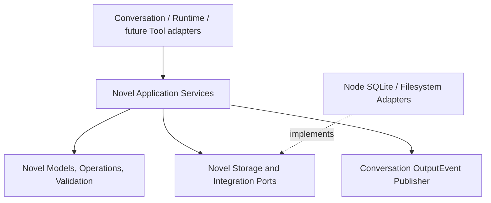

# Novel Layer Implementation Plan

## 1. Document Status

This document is the authoritative implementation plan for the Novel layer as of August 2, 2026.

- The current active repository track is Novel Task N0 through Task N11.
- Runtime Task 1 through Task 7 remains documented in `docs/implementation-plan.md` but is paused while the Novel track is active.
- Novel implementation must preserve the accepted domain and architecture boundaries in `docs/novel-domain.md`.
- Agent-facing Novel Tools, Tool YAML, Prompt composition, Agent definitions, and CLI/GUI/Web Novel interfaces are outside this plan.
- Each completed Novel step must be validated and committed independently before the next step begins.

## 2. Autonomous Execution Agreement

The repository protocol in `AGENTS.md` remains authoritative. During the active Novel track the agent may autonomously plan, implement, validate, document, and commit the next incomplete Novel step without waiting for approval.

The mandatory cycle is:

```text
Read AGENTS.md and the active Novel task
    ↓
Read docs/novel-domain.md and relevant existing code
    ↓
Publish one concrete step plan
    ↓
Implement only that step
    ↓
Run focused validation
    ↓
Run pnpm check and all established Core smoke scripts
    ↓
Review scope, generated files, secrets, and formatting
    ↓
Commit the step immediately
    ↓
Publish the next step plan and continue
```

Autonomous authority does not permit the agent to:

- implement Agent-facing Novel Tools or Tool YAML
- reopen unrelated Runtime checkpoints
- silently choose a decision explicitly marked unresolved when implementation cannot proceed safely without it
- combine multiple Novel task boundaries into one commit
- expose SQLite, Node, Pi, process placement, filesystem paths, or future Rust details through platform-neutral Novel contracts

## 3. Accepted Technical Boundary



The implementation follows these rules:

- one Workspace corresponds to one Novel
- `runtime.sqlite` and `novel.sqlite` remain separate
- each top-level Conversation may own one active Draft Session
- multiple Conversations may own independent Drafts concurrently
- each Draft owns one durable `draft.sqlite`
- each Draft has one serialized Draft Writer
- each Novel has one serialized canonical Commit Writer
- Draft operations use short SQLite transactions
- canonical Commit uses one short SQLite transaction
- Draft state never replaces the canonical SQLite file directly
- Domain Operations are the deterministic Commit and Rebase contract
- the canonical database is the authority for accepted Novel state, Commit existence, and NovelRevision
- external Commit payload files are auxiliary immutable history, not Commit authority
- all public Novel application and port methods are asynchronous
- a Node adapter may use synchronous SQLite internally behind a serialized asynchronous boundary

## 4. Explicitly Deferred Types

The following contracts are not invented during foundation tasks:

```text
StoryTimeDescription
ManuscriptAnchor
ManuscriptRange
StoryUnitBlockState
StoryUnitAbandonment
OrderKey
```

Their implementation gates are:

- `OrderKey`, `StoryUnitBlockState`, `StoryUnitAbandonment`, and `StoryTimeDescription` must be resolved before the affected Task N9 outline steps.
- `ManuscriptAnchor` and `ManuscriptRange` must be resolved before the affected Task N10 manuscript steps.
- Earlier tasks must not add placeholder public contracts that silently predetermine these decisions.

## 5. Task Graph

```mermaid
flowchart LR
    N0["N0<br/>Activate Track"]
    N1["N1<br/>Foundation"]
    N2["N2<br/>Canonical Store"]
    N3["N3<br/>Draft Sessions"]
    N4["N4<br/>Operation Engine"]
    N5["N5<br/>Character / Location"]
    N6["N6<br/>Canonical Commit"]
    N7["N7<br/>Rebase / Conflict"]
    N8["N8<br/>Conversation / Events"]
    N9["N9<br/>Outline"]
    N10["N10<br/>Manuscript / Publication"]
    N11["N11<br/>Projection / Recovery"]

    N0 --> N1 --> N2 --> N3 --> N4 --> N5 --> N6 --> N7 --> N8 --> N9 --> N10 --> N11
```



## 6. Task N0: Activate the Novel Track

### N0-A Implementation Plan

Create this implementation plan and update repository execution documents so Novel work is no longer described as deferred.

### N0-B Deliverables

- `docs/novel-implementation-plan.md`
- `AGENTS.md` active-track and recovery instructions
- `docs/implementation-plan.md` reference to the separate Novel track
- `docs/architecture.md` removal of the stale claim that the Novel domain is intentionally deferred

### N0-C Exit Criteria

- Novel N0 through N11 is the documented current active track.
- Runtime Task 1 through Task 7 is paused rather than deleted.
- Tool implementation remains excluded.
- Recovery reading includes this plan while the Novel track is active.

**Status:** completed by the commit that introduces this plan.

## 7. Task N1: Novel Foundation Protocols

### N1-A Module Skeleton

Create platform-neutral and Node adapter roots:

```text
core/src/novel/
core/src/node/novel/
```

Add explicit index exports without adding Tool code.

### N1-B Stable Identities

Define opaque public identities required by infrastructure:

```text
NovelId
NovelDraftSessionId
NovelOperationId
NovelCommitId
NovelConflictId
NovelArtifactId
```

### N1-C Version Contracts

Define and validate distinct contracts:

```text
NovelRevision
NovelSchemaVersion
NovelEntityVersion
```

`NovelRevision` remains opaque and equality-only. `NovelSchemaVersion` is migration state. `NovelEntityVersion` supports entity replacement and conflict preconditions.

### N1-D Foundation Ports and Failures

Define Clock and ID factories plus payload-free public validation and lifecycle errors. Important files receive concise top-level purpose comments. Important execution boundaries use structured redacted logs without Novel payloads, text, paths, raw errors, stacks, or causes.

### N1-E Validation

Add focused foundation smoke coverage, then run the complete repository suite.

## 8. Task N2: Canonical Novel Store

### N2-A Store Location

Define a Novel Store location derived from the accepted Workspace Store:

```text
storeDir/
├── runtime.sqlite
├── novel.sqlite
├── novel-staging/
├── novel-history/commits/
└── novel-artifacts/
```

Physical paths remain Node-only.

### N2-B Canonical Bootstrap

Create initial canonical schema and migrations for:

```text
novel_metadata
novel_commits
novel_outbox
novel_draft_sessions
novel_schema_migrations
```

### N2-C Identity and Migration Validation

Verify exact Workspace and Novel identity, monotonic schema migration, and fixed safe failures when a database belongs to another Workspace or is structurally invalid.

### N2-D Validation

Add canonical bootstrap, identity, migration, reopening, and redacted logging smoke coverage.

## 9. Task N3: Durable Draft Sessions

### N3-A Draft Protocol

Implement Draft identity, status, base revision, owner Conversation, and lifecycle services without Commit or Rebase behavior.

### N3-B Consistent Snapshot

Use the Node `node:sqlite` backup API behind `NovelSnapshotter` to create `draft.sqlite` from the exact canonical base revision. Ordinary filesystem copy is not an accepted snapshot implementation.

### N3-C Lifecycle

Implement:

```text
startDraft
getActiveDraft
resetToMain
rollback
recoverDraftSessions
```

`startDraft` never overwrites an existing active Draft. `rollback` terminates the Draft. `resetToMain` preserves the session identity while replacing its working state from the latest canonical revision.

### N3-D Validation

Cover multiple Conversation Drafts, same-Conversation exclusivity, restart recovery, reset, rollback, snapshot failure cleanup, and path redaction.

## 10. Task N4: Domain Operation Engine

### N4-A Operation Protocol

Define immutable versioned Domain Operations and preconditions. Operations contain no closures, raw SQL, Provider requests, or deferred content generation.

### N4-B Registry and Executor

Implement a typed Operation Registry and executor behind platform-neutral repository ports.

### N4-C Draft Operation Journal

Create Draft control tables for ordered Operations, digests, metadata, conflicts, projections, and outbox state as required by the implemented step.

### N4-D Serialized Draft Writer

One short Draft SQLite transaction validates an Operation, records it, applies it through a handler, updates Draft metadata, and records the outbox item. Queue failure cannot poison later writes.

### N4-E Validation

Cover immutability, registration, duplicate identity, ordering, transaction rollback, restart recovery, and log redaction with a private test Operation rather than a premature public Novel model.

## 11. Task N5: Character and Location Vertical Slice

Character and Location are the first concrete domain slice because their accepted contracts do not depend on the deferred types in Section 4.

### N5-A Models and Schema

Implement accepted Character and Location identities, stable profile fields, entity versions, canonical tables, and Draft tables through shared schema migration semantics.

### N5-B Operations

Implement deterministic create, full-replace, and safe-delete Operations with preconditions. Dynamic story state remains excluded from stable profiles.

### N5-C Services and Queries

Implement Character and Location application and query services against explicit canonical or Draft read scopes. No Tool adapters are added.

### N5-D Validation

Cover Draft create/replace/delete, canonical isolation, entity-version conflicts, restart recovery, invalid profile fields, and content-safe logs.

## 12. Task N6: Canonical Commit

### N6-A ChangeSet

Freeze the effective Draft Operation sequence, validate its canonical form, calculate its digest, and stop later mutation from joining that ChangeSet.

### N6-B Commit Writer

Serialize canonical Commit for one Novel, validate base revision, replay the complete ChangeSet, validate final invariants, insert Commit metadata, increment NovelRevision exactly once, and insert the canonical outbox record in one short SQLite transaction.

### N6-C History Payload

Before implementing this step, resolve and document the exact immutable Commit payload encoding, filename, atomic preparation, digest verification, orphan cleanup, and missing-file recovery protocol. The accepted default direction is an external canonical JSON or JSONL payload with metadata authority in `novel.sqlite`.

### N6-D Validation

Cover success, complete rollback, stale revision, duplicate Commit identity, digest mismatch, outbox persistence, interrupted payload preparation, and restart recovery.

## 13. Task N7: Rebase and Conflict

### N7-A Rebase Candidate

Preserve the stale source Draft, snapshot the latest canonical revision into a sibling candidate, and replay source Operations with their original preconditions.

### N7-B Conflict Protocol

Implement the accepted conflict kinds and safe digest-based conflict snapshots without logging Novel content.

### N7-C Resolution

Implement `keep-canonical`, validated `keep-draft`, `drop-operation`, and manual replacement Operation strategies.

### N7-D Approval Invalidation

Any Rebase or conflict resolution that changes base revision or effective ChangeSet digest invalidates previous Approval.

### N7-E Validation

Use concurrent Character and Location Drafts to cover non-overlapping automatic Rebase, same-field conflict, delete/update conflict, idempotent create, manual resolution, crash recovery, and successful post-resolution Commit.

## 14. Task N8: Conversation and OutputEvent Integration

### N8-A Binding

Implement the Conversation-to-Novel and active-Draft binding boundary without making Conversation the Novel aggregate.

### N8-B Lifecycle Events

Define internal Novel lifecycle records and public Novel OutputEvents for Draft, Commit, Rebase, conflict, and recovery transitions. Payloads expose stable safe identities and metadata rather than Novel content.

### N8-C Outbox Dispatcher

Dispatch canonical and Draft outbox records idempotently through the accepted Conversation Output publisher and Runtime Journal boundary.

### N8-D Approval Bridge

Bind asynchronous Approval requests and responses to exact ChangeSet digests without holding SQLite transactions while waiting.

### N8-E Validation

Cover Event ordering, retry-stable IDs, dispatcher restart, duplicate delivery, Approval staleness, Conversation identity, and redacted logs.

## 15. Task N9: Story Outline Vertical Slice

This task begins only after its affected deferred contracts are explicitly resolved and recorded.

### N9-A StoryOutline and StoryUnit

Resolve `OrderKey`, then implement the ordered stable StoryUnit tree.

### N9-B Status and Reasons

Resolve `StoryUnitBlockState` and `StoryUnitAbandonment`, then implement planning, realization, blocking, abandonment, and derived parent progress.

### N9-C Leaf Plan

Resolve `StoryTimeDescription`, then implement LeafStoryUnitPlan and readiness validation.

### N9-D Event, Rhythm, and Entity Change

Implement StoryEventStep, RhythmBeat, StoryUnitEntityChange, and Character/Location bindings with stable IDs and ordering.

### N9-E Services, Operations, Queries, and Persistence

Add complete Draft and canonical vertical slices with Rebase and conflict behavior. Tool adapters remain excluded.

## 16. Task N10: Manuscript, Publication, and Realization

This task begins only after Anchor and Range contracts are explicitly resolved and recorded.

### N10-A Publication

Implement Volume and Chapter as publication structures separate from StoryOutline.

### N10-B Manuscript Blocks

Implement stable Paragraph Blocks and ordering without sentence-level domain objects.

### N10-C Anchors and Ranges

Resolve and implement ManuscriptAnchor and ManuscriptRange.

### N10-D Structural Repair

Implement Block move, split, merge, Tombstone, Redirect, and anchor repair Operations.

### N10-E Realization and Conformance

Implement StoryUnitRealization, current revision binding, conformance findings, and completion admission.

## 17. Task N11: Projection, Recovery, and End-to-End Validation

### N11-A Projections

Implement Character and Location state, contextual readiness, relationship, and conformance projections as repairable revision-bound views.

### N11-B Recovery

Implement Draft corruption detection, incomplete Commit recovery, outbox retry, interrupted Rebase recovery, staging retention, orphan cleanup, and projection rebuild.

### N11-C End-to-End Validation

Cover multi-Conversation Drafts, Commit, Rebase, conflict, Approval, Outline, Manuscript, publication, realization, recovery, and replay without Agent Tool involvement.

### N11-D Documentation and Examples

Update accepted architecture diagrams and add platform-neutral application examples. Tool examples remain deferred.

## 18. Milestones

### Milestone A: Durable Novel Workspace

Tasks N0 through N4 provide canonical storage, Draft SQLite, Operation Journal, and restart-safe Draft mutation.

### Milestone B: Concurrent Domain Commit

Tasks N5 through N8 provide a real Character/Location slice with Commit, Rebase, conflict, Approval, and OutputEvent integration.

### Milestone C: Story Planning

Task N9 provides the accepted ordered Story Outline and rolling Leaf Plan model.

### Milestone D: Manuscript Production

Tasks N10 and N11 provide manuscript, publication, realization, conformance, projections, and recovery.

## 19. Current Position

- Task N0 is completed by the commit introducing this plan.
- Task N1 is the next implementation task.
- Agent-facing Novel Tools remain deferred beyond Task N11.
