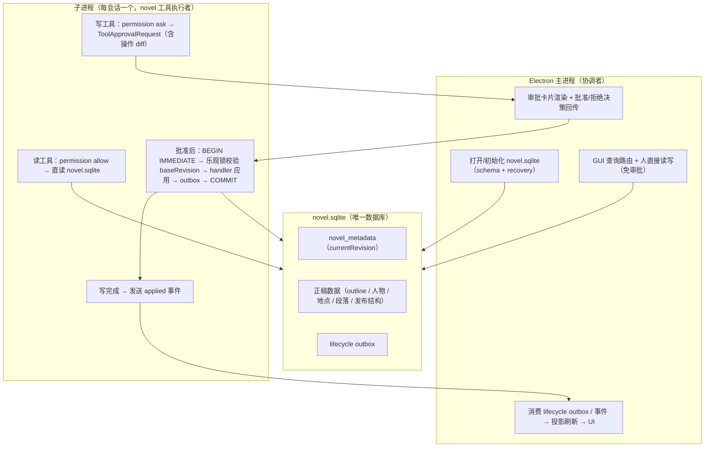
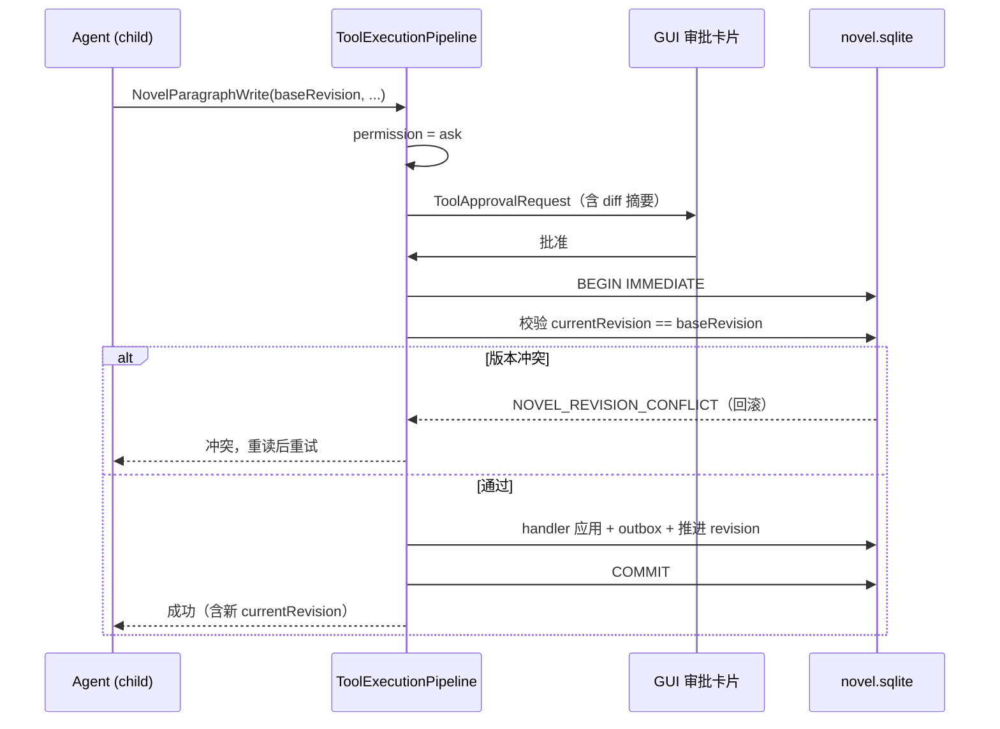

# Novel 直写 + Write 前审批 重构草案（Working Draft）

> 状态：已确认（决策 1A/2A/3A/4A，见第 9 节）。实施按 P1→P6 进行。
> 本文件是对现有 draft/commit/rebase 机制的替代方案。
> 相关文档：`docs/novel-agent-tools.md`（将被本次改造推翻的契约）、
> `docs/novel-domain.md`、`docs/desktop-runtime-integration-plan.md`。

## 1. 背景与动机

当前架构存在四个叠加问题，本次改造一并收敛：

1. **Agent novel 工具全部执行失败**：child 运行时用 manifest 桩注册表执行，
   真实 SQLite 服务只存在于主进程（`NodeNovelWorkspaceHost`），从未注入 child。
2. **draft 机制冗余**：draft 存在的唯一理由是"先写后整批审批"。改为
   **write 前审批**后，未批准的改动根本不会执行，草稿隔离失去意义。
3. **会话级长事务不可行**：SQLite WAL 单写者；会话级写事务会锁库、
   崩溃全丢、且与 conversation journal 恢复冲突。事务边界必须是
   **单次 write 的自动短事务**。
4. **审批语义本就存在**：`CHILD_TOOL_PERMISSION_RULES` 已将所有写工具标为
   `ask`，审批卡片管线已接入（`1e0b3fe`）。本次只是让审批通过后的执行
   真正落到库上。

## 2. 目标架构

## 3. 设计决策

| 决策 | 结论 | 理由 |
|---|---|---|
| 事务边界 | 每次 write 调用 = 自动短事务 | SQLite 撑不起会话级长事务；write 前审批已提供更粗的边界 |
| 事务管理 | 由 host 自动管理，工具协议不暴露 start/commit | 简化 agent 协议；无事务悬空 |
| 审批位置 | write 执行前（permission `ask`） | 未批不执行，正式稿永远干净；复用现有审批管线 |
| 并发控制 | 乐观锁：写参数带 `baseRevision`，读返回 `currentRevision` | 多会话并发防静默覆盖 |
| 执行位置 | child 子进程直连 `novel.sqlite` | 消解"完全依赖主进程"；消除 RPC 请求-响应层 |
| 草稿 | 全部删除（draft session / 副本 / changeSet / rebase / approval 服务） | 审批前置后无隔离需求 |
| 审批 diff | 写工具在 approval request 中携带结构化操作摘要 | 让人能判断"将要改什么" |

## 4. Tools 层改动明细（本次重点）

### 4.1 工具清单增删

**删除（4 个，`core/src/tools/novel/draft/` 整目录删除）：**

- `NovelDraftStatus`
- `NovelDraftCommit`
- `NovelDraftRollback`
- `NovelDraftRebase`

**保留（19 个 + TodoWrite = 20 个）：**

- 读（6）：`NovelOutlineRead`、`NovelCharacterRead`、`NovelLocationRead`、
  `NovelParagraphRead`、`NovelVolumeRead`、`NovelChapterRead`
- 写（13）：`NovelOutlineWrite/Edit`、`NovelCharacterWrite/Edit`、
  `NovelLocationWrite/Edit`、`NovelParagraphWrite/Edit`、
  `NovelVolumeWrite/Edit`、`NovelChapterWrite/Edit`、`NovelDelete`

### 4.2 Schema 变更

每个工具目录下的 `schemas.ts`：

1. **`ScopeSchema` 移除 `"draft"`**（现为 `canonical | draft`）：
   - 读工具的参数 `scope` 整体移除（只有 canonical 一种值，单值参数是噪音）。
   - 现有 `resolveReadScope(conversationId, scope)` 删除 draft 分支，读固定
     走 `canonicalNovelReadScope`。
2. **写工具参数新增 `baseRevision: string`**：来自最近一次读返回的
   `revision.currentRevision`；缺省允许（首次写入无基态），但传入时必须匹配。
3. **读工具返回值新增 revision 字段**：
   `{ revision: { currentRevision: string }, ...原有数据 }`。
4. **错误码变更**：
   - 新增 `NOVEL_REVISION_CONFLICT`（乐观锁失败，retryable，agent 应重读后重试）。
   - 删除 `NOVEL_DRAFT_START_FAILED`、`NOVEL_DRAFT_COMMIT_FAILED`、
     `NOVEL_DRAFT_ROLLBACK_FAILED`、`NOVEL_DRAFT_REBASE_FAILED` 等。

### 4.3 ToolService 改造（provider-neutral）

每个写工具目录（outline/character/location/paragraph/publication）的
`ToolService.ts`：

1. **删除 `resolveOrStartDraft(conversationId)`**（现于
   `core/src/tools/novel/outline/ToolService.ts:488`）：
   write/edit 不再隐式 startDraft，不再持有 `NovelDraftSession`。
2. **写操作改为直接构造 domain operation → canonical writer**：
   `createStoryUnit(unit)` / `replaceStoryUnit(id, baseRevision, content)`，
   由 `SqliteNovelCanonicalWriter.applyOperation` 在单个事务内执行。
3. **批处理原子语义调整**：现有"failed item stops batch，earlier items
   remain applied"（契约第 7 条）改为**一批 = 一个事务，任一失败整批回滚**，
   与单事务语义一致。
4. **审批 diff 描述**：每个写方法暴露 `describeOperation(arguments)`，
   渲染为可读摘要（如"新增章节《XX》"、"修改人物 张三"、"删除段落 #id"），
   由审批请求工厂挂到 approval request 的 summary。

### 4.4 权限规则更新

`core/src/node/runtime/child/ChildToolExecutionFactory.ts`：

1. `CHILD_TOOL_PERMISSION_RULES`：`child_read_allow` 保留；
   `child_write_edit_ask` 删除 draft 工具名（4 个），其余不变。
2. `StaticToolExecutionPolicyResolver` 工具列表同步删除 draft 4 个条目。

### 4.5 工具注册与 manifest

- `core/src/node/agent/manifest/NovelConversationManifestComposition.ts`：
  删除 draft 工具组（`NOVEL_DRAFT_TOOL_GROUP_MANIFEST`、
  `createNovelDraftToolRegistry`、`NovelDraftToolService`）与
  `unavailableDraftToolService` 桩。
- `core/src/tools/novel/index.ts` 及 `docs/novel-agent-tools.md` 契约同步更新。
- 工具总数 24 → 20（含 TodoWrite）。

### 4.6 与现有契约文档的冲突（需改写 `docs/novel-agent-tools.md`）

| 现有契约 | 新契约 |
|---|---|
| 1. 显式 read scope：`canonical \| draft` | scope 参数移除，读固定 canonical |
| 2. 工具面不做乐观锁 digest | 工具面暴露 `baseRevision` / `currentRevision` |
| 3. Draft-only writes：commit 前不生效 | 写 = 审批后直写 canonical，立即生效 |
| 7. 批处理部分应用 | 一批 = 一个事务，整批原子 |

## 5. 非 Tools 层改动（P1–P6 摘要）

### P1：canonical 直写执行层（node 层，聚焦提交）

- 新建 `core/src/node/novel/sqlite/SqliteNovelCanonicalWriter.ts`：
  `applyOperation({ operation, conversationId, baseRevision })` →
  `BEGIN IMMEDIATE` → 事务内读 `novel_metadata.currentRevision` 与
  `baseRevision` 比对（不符抛 `NOVEL_REVISION_CONFLICT`）→
  `createSqliteNovelMutationContext(db)` + 现有 handler 执行 →
  写 `lifecycle outbox` → 推进 revision → `COMMIT`。
- 事务模板借鉴 `SqliteNovelCommitStore.commit`
  （`core/src/node/novel/sqlite/SqliteNovelCommitStore.ts:104`）。

### P2：工具层去 session（core/tools）

- 见第 4 节；所有写工具改走 canonical writer，读固定 canonical。

### P3：子进程接线（child composition）

- 新建 `core/src/node/runtime/child/novel/ChildNovelServiceRegistry.ts`：
  用 `NodeNovelStoreLocator` 解析 `novel.sqlite`（child 已有 storageRoot +
  workdir，先例：manifest store 直开），构造真实查询服务 + canonical writer。
- `DesktopRuntimeChildCompositionFactory` 执行注册表换真实服务；
  manifest composition 退化为纯描述（toolView/policy/prompt），桩不再进执行。
- 写完成发 `novel.write.applied` 输出事件；主进程收事件跑投影刷新。

### P4：删除 draft 模块

- `core/src/novel/draft/`、`core/src/novel/rebase/`、conflict / resolution
  plan / changeSet / approval（changeSet 审批）相关模块，
  `core/src/node/novel/sqlite/` 下对应 store 与 snapshotter。
- 可选保留：`novel_operations` 审计表（operation + revision +
  conversationId + approvedAt），替代"历史提交"展示。

### P5：审批展示增强 + GUI 适配

- 审批卡片显示操作 diff（approval request factory / projector 层）。
- 确认批准/拒绝决策回传链路（`RuntimeApprovalDecisionInputHandler`）
  端到端可用；GUI 草稿状态展示移除。

### P6：文档 + 全量测试

- 更新 `docs/architecture.md`、`docs/novel-agent-tools.md`、
  `docs/novel-implementation-plan.md`、`docs/desktop-runtime-integration-plan.md`。
- 新增"无 session 工具"单测与"子进程直写 + 乐观锁冲突"集成冒烟。

## 6. 写工具时序（审批 → 执行）

## 7. 好处

1. 概念收敛：一个库、一种事务语义（write=自动短事务）、一个审批点（write ask）。
2. 故障模型极简：崩溃最多丢最后一次 write；无孤儿 draft、无恢复协调。
3. 依赖变薄：child 自持数据访问，读零往返；主进程只做初始化 / UI / 投影。
4. 审批可控：粒度=单操作，可叠加"会话信任自动放行"权限规则。
5. 并发安全：SQLite 短事务串行化 + 乐观锁防静默覆盖。
6. 删码量大：draft / commit / rebase / approval / recovery 一层消失。

## 8. 客观代价与缓解

| 代价 | 缓解 |
|---|---|
| 审批疲劳（一章可能批几十次） | 会话信任规则自动放行；同批合并为一个 approval request |
| 失去整体回滚 | 手动改回；或基于 `novel_operations` 审计做撤销（后置功能） |
| 子进程直写 = schema 多进程耦合 | WAL + busy_timeout + 乐观锁；schema 变更兼容短暂并存 |
| 重构面大（工具层 + 删除模块 + 测试重写） | 按 P1→P6 聚焦提交，逐步验证 |

## 9. 已确认决策点（2026-08-06）

1. **1A：保留操作审计**。新增 `novel_operations` 表（operation + revision +
   conversationId + approvedAt），GUI"历史提交"改为操作历史。
2. **2A：批处理原子语义**。Write/Edit 的 values 数组 = 一个事务，任一失败
   整批回滚；替换现有"部分应用"契约。
3. **3A：移除读工具 scope 参数**。读固定 canonical，不做旧参数兼容。
4. **4A：child 直写 novel.sqlite**。子进程自持数据访问，主进程只做初始化 /
   UI / 投影；并发安全靠 SQLite 短事务串行化 + baseRevision 乐观锁。

其余实施细节（含"会话信任自动放行"等缓解项）按草案第 5 节 P1→P6 顺序推进。
